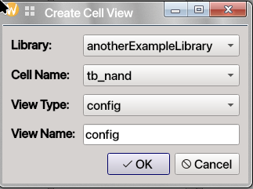
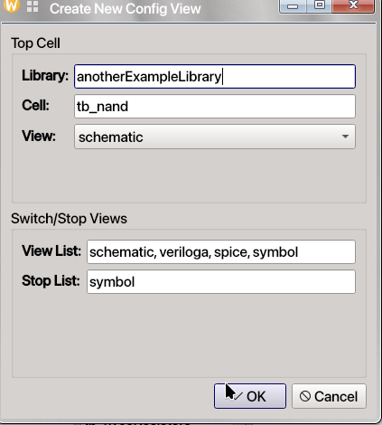
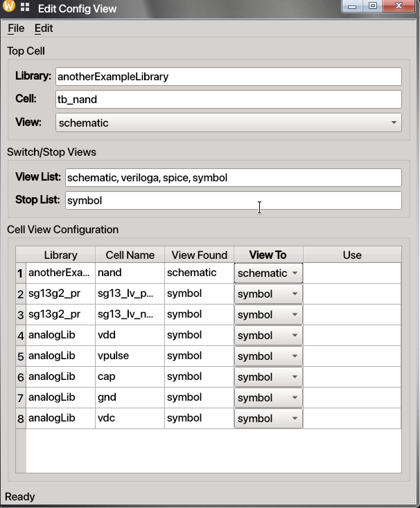

# Revolution EDA Config Editor

This guide explains how to use a `config` view to control netlisting in Revolution EDA. A
config view lets you decide which cellview the netlister should use at each point in a
hierarchy, for example `schematic`, `symbol`, `spice`, or `veriloga`.


## Quick Orientation

- A **config view** is created as a normal cellview, but its purpose is netlisting control.
- A config view is always tied to a top-level **schematic** view.
- The editor shows the netlister's current view choice in **View Found**.
- You can override that choice per cell through the **View To** selection column.
- `File -> Update` rebuilds the configuration table from the referenced schematic hierarchy.
- `File -> Save` writes the config view to disk.

## What a Config View Does

Without a config view, the netlister follows the application's switch/stop view rules.
With a config view, you can override those defaults for specific cells in a design
hierarchy.

Typical uses include:

- choosing a `symbol` or `spice` view instead of a `schematic`
- stopping hierarchy traversal at a selected block
- mixing behavioural and transistor-level views in the same netlist

## Typical Config Flow

1. Create a new cellview whose type and name include `config`.



2. Choose the source schematic view that the config will control.



3. Review the default switch/stop view lists. Click `OK` button.
4. Open the config editor window.



5. Use `File -> Update` to populate the hierarchy table.
6. Change **View To** combobox for any cells you want to override.
7. Save the config view.
8. When creating a netlist from the schematic side, choose the config view instead of the
   plain schematic view.


## Creating a Config View

Create a config view the same way you create other cellviews in the Library Browser.

- Open the **Create New CellView** dialog.
- Select `config` as the view type.
- Enter a view name that includes `config`.

After that, Revolution EDA opens a config-specific setup dialog where you choose:

- the top-level schematic view the config is based on
- the default **View List** used for switch-view traversal
- the default **Stop List**


## Config Editor Window

The config editor is simpler than the schematic, symbol, and layout editors. It is centered
around three areas:

1. **Top Cell**
   - Library
   - Cell
   - Schematic view selection
2. **Switch/Stop Views**
   - View List
   - Stop List
3. **Cell View Configuration**
   - one row per discovered cell in the hierarchy
   - current resolved view in **View Found**
   - chosen override in **View To**

The `View To` field is presented as a combo box for each row, so you can choose from the
allowed views already known for that cell.

## Menu Actions You Will Use Most

### File Menu

The config editor uses a very small File menu with only the actions required for config
editing.

- `File -> Update`: rebuilds the configuration table from the referenced schematic hierarchy.
- `File -> Save`: saves the config view JSON to disk.

File menu actions:

| Action | Shortcut | Notes |
| --- | --- | --- |
| `File -> Update` | None | Re-evaluates the hierarchy using the current source schematic and view lists. |
| `File -> Save` | None | Saves the config view to disk. |

### Edit Menu

The config editor currently shows an `Edit` menu in the menu bar, but the main user-facing
workflow is driven by the File menu and the configuration table itself.

## How to Change Netlisting Behavior

There are two main ways to change what the netlister will use.

### 1. Change the View List / Stop List

You can edit the comma-separated values in:

- **View List**
- **Stop List**

Then use `File -> Update` to rebuild the configuration table. The **View Found** column will
change to reflect the new traversal preferences.

### 2. Override a Specific Cell in the Table

For each discovered cell, use the **View To** combo box to override which view should be used
during netlisting.

This is especially useful when you want one block to netlist from:

- a symbol view
- a Verilog-A view
- a SPICE subcircuit view
- a schematic view

If you override a cell that has deeper hierarchy under it, then using `Update` may change the
set of rows shown in the editor because the traversal path has changed.


## Netlisting with a Config View

At present, netlisting is still started from the schematic side rather than directly from the
config editor window.

Typical workflow:

1. Save the config view.
2. Open the relevant schematic or return to it.
3. Start netlist creation from the schematic editor.
4. In the netlist/export dialog, select the **config** view instead of the default
   schematic-only traversal.
5. Generate the netlist.

The resulting netlist follows the hierarchy choices defined by your config view.

## Practical Example

Imagine a top-level schematic containing a child cell named `example1`.

- If `example1` is mapped to `symbol`, the netlister will stop descending into that block and
  use the symbol-level netlisting path.
- If `example1` is mapped to `schematic`, the netlister can traverse into that hierarchy and
  continue according to the selected views below it.

This lets you compare behavioural and transistor-level netlisting strategies without editing
the original schematic hierarchy.

Compare these two actual netlists when `schematic` cellview or `spice` cellview is used for 
netlisting.

```spice

**********************************************************************************
** Revolution EDA CDL Netlist
** Library: anotherExampleLibrary
** Top Cell Name: tb_nand
** View Name: schematic
** Date: 2026-03-19 22:01:43.262142
**********************************************************************************
*.GLOBAL gnd!

*I0 is excluded via NetlistIgnore attribute
*I2 is excluded via NetlistIgnore attribute
*I6 is excluded via NetlistIgnore attribute
VI3 in1 gnd! PULSE( 0 {vdd} 5n 1n 1n {per*0.5} {per} )
VI5 vdd! gnd! DC {vdd} AC 0
VI4 in2 gnd! PULSE( 0 {vdd} 50n 1n 1n {per * 0.5} {per} )
XI1 in1 in2 out vdd! gnd! NAND
CI7 out gnd! C=0.1f M=1

* Subcircuit Definitions

.SUBCKT nand in1 in2 out vdd vss
XI0 net0 in2 vss vss sg13_lv_nmos w=2.0u l=0.45u ng=1 m=1
XI4 out in2 vdd vdd sg13_lv_pmos w=4.0u l=0.45u ng=2 m=1
XI3 out in1 vdd vdd sg13_lv_pmos w=4.0u l=0.45u ng=2 m=1
XI1 out in1 net0 vss sg13_lv_nmos w=2.0u l=0.45u ng=1 m=1
.ENDS
```

```spice

**********************************************************************************
** Revolution EDA CDL Netlist
** Library: anotherExampleLibrary
** Top Cell Name: tb_nand
** View Name: schematic
** Date: 2026-03-19 22:05:19.553266
**********************************************************************************
*.GLOBAL gnd!

*I0 is excluded via NetlistIgnore attribute
*I2 is excluded via NetlistIgnore attribute
*I6 is excluded via NetlistIgnore attribute
VI3 in1 gnd! PULSE( 0 {vdd} 5n 1n 1n {per*0.5} {per} )
VI5 vdd! gnd! DC {vdd} AC 0
VI4 in2 gnd! PULSE( 0 {vdd} 50n 1n 1n {per * 0.5} {per} )
XI1 in1 in2 out vdd! gnd! NAND
CI7 out gnd! C=0.1f M=1
.INC "/home/eskiyerli/onedrive_reveda/Projects/designLibraries/anotherExampleLibrary/nand/nand2.sp"

```

Both netlists are valid netlists but use different cellviews for netlisting.

## Final Notes

- A config view is a **netlisting control layer**, not a drawing editor.
- Always use `File -> Update` after changing the source schematic selection or the switch/stop
  lists.
- Save the config view before running netlisting from the schematic side.
- If the hierarchy shown in the table changes after an override, that is expected: the chosen
  view may have changed what the netlister can see below that point.

Used well, the config editor gives you precise control over mixed-view netlisting in complex
designs.
