# Revolution EDA Layout Editor

This guide targets designers already familiar with custom IC layout tools such as Cadence
Virtuoso Layout L. Revolution EDA follows the same core workflow: choose layers, place
geometry, add pins and labels, reuse hierarchy, and export the finished cell for downstream
verification and tapeout-oriented flows.

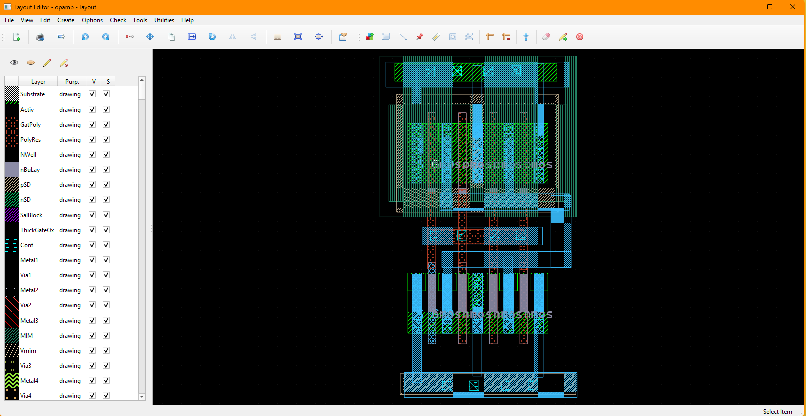

## Quick Orientation (for Virtuoso Users)

- **Library Browser**: open a layout or pcell view from the design library browser.
- **Layer Selection Window (LSW)**: similar to the layer palette in other layout editors;
  choose the active drawing layer and control layer visibility/selectability.
- **Drawing**: press `R` for rectangles, `W` for paths, `P` for pins, `L` for labels,
  `V` for vias, and `G` for polygons.
- **Properties**: select an object and press `Q` to inspect or edit its properties.
- **Hierarchy**: `Go Down` and `Go Up` support normal hierarchical layout editing.
- **Export**: use `Tools -> Export GDS` to write a GDS file from the current layout.

## Virtuoso to Revolution EDA Mapping

The table below maps common layout-editor actions to their Revolution EDA equivalents.

| Virtuoso Action | Revolution EDA Equivalent | Notes |
| --- | --- | --- |
| Add layout instance | `Create -> Create Instance...` or press `I` | Select a layout or pcell view, then place it in the canvas |
| Draw rectangle | `Create -> Create Rectangle...` or press `R` | Draws on the active LSW layer |
| Route metal path | `Create -> Create Path...` or press `W` | Width and routing mode come from the path dialog |
| Place pin | `Create -> Create Pin...` or press `P` | Creates both pin geometry and a matching label |
| Place label | `Create -> Create Label...` or press `L` | Uses text layers from the active PDK |
| Place via | `Create -> Create Via...` or press `V` | Supports single vias and via arrays |
| Draw polygon | `Create -> Create Polygon...` or press `G` | Multi-point polygon drawing on active layer |
| Edit properties | Select item and press `Q` | Works for geometry, instances, vias, pins, labels, and PCells |
| Stretch path | `Edit -> Stretch` or press `S` | Especially useful for path endpoint editing |
| Go down hierarchy | `Edit -> Hierarchy -> Go Down` | Opens child layout in edit or read-only mode |
| Go up hierarchy | `Edit -> Hierarchy -> Go Up` | Returns to the parent layout and refreshes it |
| Export GDS | `Tools -> Export GDS` | Uses unit and precision from the active PDK by default |

## Typical Layout Flow

1. Open or create a layout view from the Library Browser.
2. In the LSW, choose the active drawing layer.
3. Draw base geometry with rectangles and paths.
4. Add vias, labels, and pins where needed.
5. Place child instances or PCells using `Create -> Create Instance...`.
6. Use `q` key to open properties dialogue to refine geometry, instance parameters, and 
   coordinates.
7. Use hierarchy navigation to edit child cells in context.
8. Export the completed cell with `Tools -> Export GDS`.

<!-- Screenshot placeholder: Typical layout editing flow -->

## Menu Actions You Will Use Most

This section summarizes the most common layout editor actions by menu.

### File Menu

The File menu handles saving, refreshing, printing, and exporting your layout view.

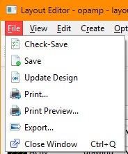

- `File -> Check-Save`: saves the current layout.
- `File -> Save`: saves the current layout.
- `File -> Update Design`: reloads referenced cells from disk, useful after editing child
  layouts in another window.
- `File -> Print...`: opens the print dialog for the current layout view.
- `File -> Print Preview...`: shows a print preview.
- `File -> Export...`: exports the current view as an image.
- `File -> Close Window`: closes the current layout editor window.

File menu actions and shortcuts:

| Action | Shortcut | Notes |
| --- | --- | --- |
| `File -> Check-Save` | None | Saves the current layout view. |
| `File -> Save` | None | Saves the current layout view. |
| `File -> Update Design` | None | Reloads referenced cells and refreshes the scene. |
| `File -> Print...` | None | Sends the current view to a printer. |
| `File -> Print Preview...` | None | Previews printed output. |
| `File -> Export...` | None | Exports the current view as an image file. |
| `File -> Close Window` | `Ctrl+Q` | Closes the active layout editor window. |

### View Menu

The View menu controls navigation and the visible area of the layout.

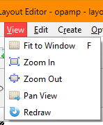

- `View -> Fit to Window`: fits the current design extents into the editor window.
- `View -> Zoom In`: zooms in one step.
- `View -> Zoom Out`: zooms out one step.
- `View -> Pan View`: enters pan mode; clicking a point recenters the visible scene around
  that point.
- `View -> Redraw`: refreshes the layout display.

Additional navigation behavior in the canvas:

- Use the **mouse wheel** for continuous zooming.
- Press **arrow keys** to shift the scene left, right, up, or down.
- Press **`Z`** to enter box-zoom mode and draw a zoom rectangle.

View menu actions and shortcuts:

| Action | Shortcut | Notes |
| --- | --- | --- |
| `View -> Fit to Window` | `F` | Fits all visible layout items into the window. |
| `View -> Zoom In` | None | Step zoom in; mouse wheel also zooms. |
| `View -> Zoom Out` | None | Step zoom out; mouse wheel also zooms. |
| `View -> Pan View` | None | Click a point to center the scene on that location. |
| `View -> Redraw` | None | Refreshes the rendered view. |
| Box Zoom | `Z` | Draw a rectangle to zoom to a region. |

### Edit Menu

The Edit menu contains the core geometry editing commands.

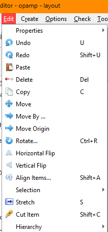

- `Edit -> Properties -> Object Properties...`: opens the appropriate property editor for the
  selected object.
- `Edit -> Move`: moves selected items interactively.
- `Edit -> Move By ...`: moves the selection by an exact X/Y offset.
- `Edit -> Move Origin`: redefines the layout origin point used for displayed coordinates.
- `Edit -> Stretch`: stretches supported shapes, especially layout paths.
- `Edit -> Rotate...`: rotates the selection around a clicked pivot point.
- `Edit -> Horizontal Flip`: mirrors selected items horizontally.
- `Edit -> Vertical Flip`: mirrors selected items vertically.
- `Edit -> Align Items...`: aligns selected shapes by edge/center or to a guide line.
- `Edit -> Cut Item`: cuts selected rectangles, paths, or polygons with a drawn cut line.
- `Edit -> Selection`: contains `Select All` and `Unselect All`.

Property editing works on these layout object types:

- rectangles
- paths
- pins
- labels
- vias and via arrays
- polygons
- layout instances
- PCell instances

`Move By ...` snaps entered offsets to the active grid, so the final displacement may differ
slightly from the typed value if snapping is required.

`Align Items...` supports two methods:

1. **Align Edges**
2. **Align To Line**

For both methods you can choose horizontal or vertical alignment and optionally enter item
spacing.

`Cut Item` supports these results:

- selected **rectangles** are split into polygons
- selected **paths** are split into two path segments
- selected **polygons** are split into two polygons

To cut an item select the item, and then select `Edit -> Cut Item` and draw a cut line 
across the item by starting a line at the point left mouse button is pressed and finish the 
line at the point where the left mouse button is released. The cut line should cross the 
item that will be cut.

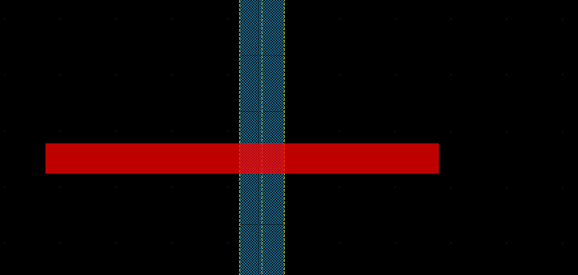

#### Edit Menu (Hierarchy)

- `Edit -> Hierarchy -> Go Down`: opens the selected layout instance in a child layout
  editor. The dialog lets you choose the destination layout view and whether it opens in
  `Edit` or `Read Only` mode.
- `Edit -> Hierarchy -> Go Up`: returns to the parent layout and refreshes the parent view.

<!-- Screenshot placeholder: Go Down Hierarchy dialog -->

Edit menu actions and shortcuts:

| Action | Shortcut | Notes |
| --- | --- | --- |
| `Edit -> Undo` | `U` | Reverts the most recent layout edit. |
| `Edit -> Redo` | `Shift+U` | Reapplies the last undone edit. |
| `Edit -> Copy` | `C` | Duplicates the current selection for interactive placement. |
| `Edit -> Delete` | `Delete` | Removes selected items. |
| `Edit -> Move` | `M` | Starts interactive move mode. |
| `Edit -> Move By ...` | None | Moves selected items by a typed X/Y offset. |
| `Edit -> Move Origin` | None | Sets a new origin point in the layout. |
| `Edit -> Stretch` | `S` | Stretches supported items, especially paths. |
| `Edit -> Rotate...` | `Ctrl+R` | Rotates around a clicked pivot point. |
| `Edit -> Horizontal Flip` | None | Mirrors selected items horizontally. |
| `Edit -> Vertical Flip` | None | Mirrors selected items vertically. |
| `Edit -> Align Items...` | `Shift+A` | Opens the alignment dialog. |
| `Edit -> Cut Item` | `Shift+C` | Cuts selected path/rectangle/polygon geometry. |
| `Edit -> Selection -> Select All` | `Ctrl+A` | Selects all scene items. |
| `Edit -> Selection -> Unselect All` | None | Clears the current selection. |
| `Edit -> Properties -> Object Properties...` | `Q` | Opens the relevant object properties dialog. |

### Create Menu

All layout creation commands are available from the Create menu and the layout toolbar.

### Create -> Create Instance... (`I`)

Use this command to place another layout view or a PCell in the current layout.

- Choose the library, cell, and view from the selection dialog.
- If the selected view is a PCell, Revolution EDA opens a parameter form based on the PCell
  constructor arguments.
- Place the instance in the layout canvas. 

If a pcell is instantiated, first select the *pcell* cellview, press `OK` button:
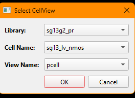

There will be another dialogue shown to determine the instance properties:

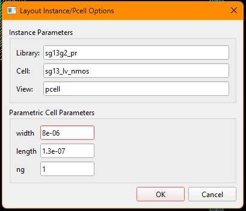

Once you press `OK` button, the new *pcell* instance will follow the mouse cursor and you 
could place wherever you want.

Standard layout instances and PCell instances can later be
edited through the object properties dialog.

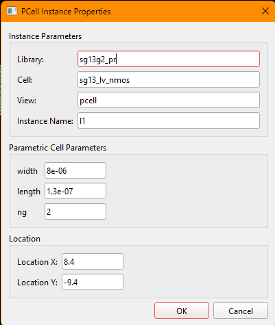

### Create -> Create Rectangle... (`R`)

Draws a rectangle on the currently active LSW layer.

- Select the target layer in the LSW.
- Start rectangle mode by pressing 'r' key or selecting `Create Rectangle` menu item.
- Click left-mouse button on the first point of the rectangle and drag the mouse cursor along diagonal of the desired rectangle and release the mouse button.

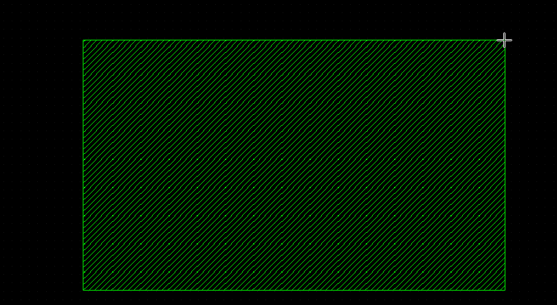

Rectangle properties let you edit the layer, width, height, and top-left coordinate.

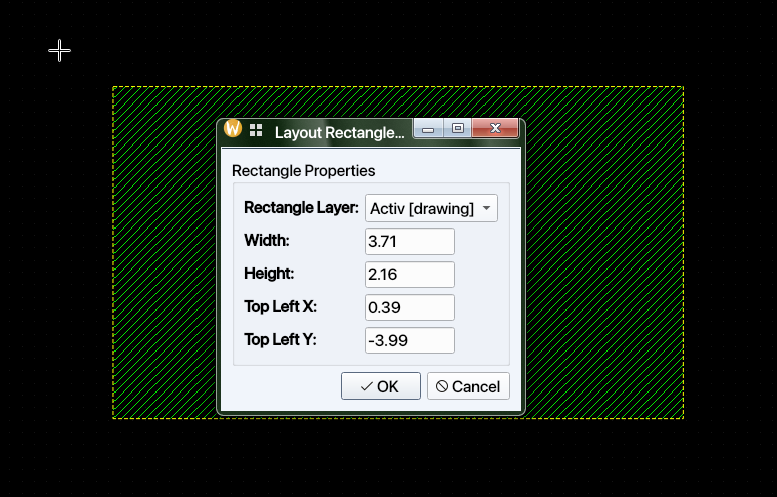

### Create -> Create Path... (`W`)

Opens the path creation dialog before entering path drawing mode.

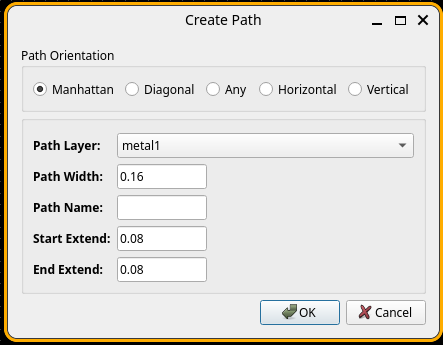

Configurable path settings include:

- path layer
- path width
- path name
- start extension
- end extension
- path orientation mode

Supported orientation modes are:

- Manhattan
- Diagonal
- Any
- Horizontal
- Vertical

The available layers and default width limits come from the active PDK's process path
definitions.

Path properties can later edit the path name, layer, width, endpoints, extensions, and angle.

### Create -> Create Pin... (`P`)

Creates a layout pin and its associated label.

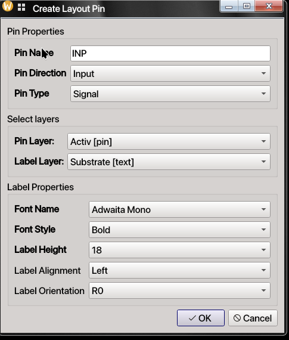

The pin dialog includes:

- pin name
- pin direction
- pin type
- pin layer
- label layer
- label font family, style, size, alignment, and orientation

Pin properties can later edit pin geometry, type information, and coordinates.
Unlike legacy layout editors, user can choose any mono-spaced font installed in the 
computer. 

Once `OK` button is clicked, layout pin rectangle can be drawn similar to layout 
rectangle is drawn, i.e. diagonally. Once layout pin rectangle is drawn, the label will 
follow the mouse cursor and can be placed on the layout. Note that Calibre or KLayout 
will extract the layout netlist starting from label locations.

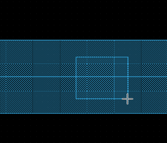
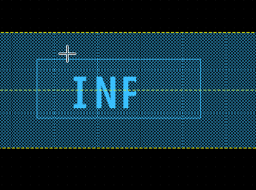

### Create -> Create Label... (`L`)

Creates a standalone layout label on one of the available text layers.

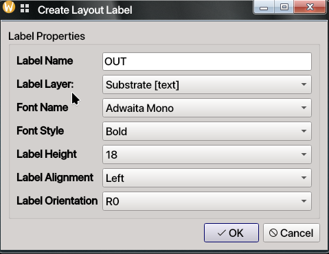

The label dialog lets you set:

- label text
- text layer
- font family and style
- text height
- alignment
- orientation

Labels are useful both for documentation and for flows that rely on layout text markers.

### Create -> Create Via... (`V`)

Creates a via or via array using the via definitions provided by the active PDK.

The via dialog supports two modes:

- **Single**: one via cut
- **Array**: repeated via cuts with entered row/column spacing and row/column counts

Via dimensions are validated against the selected via definition in the PDK.

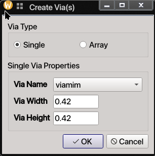

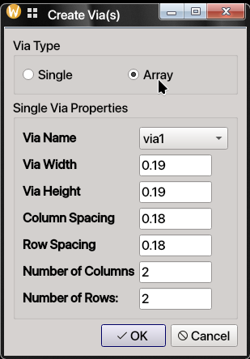

Once `OK` button is clicked, the created single via or via array will follow the mouse 
cursor and can be place wherever necessary.

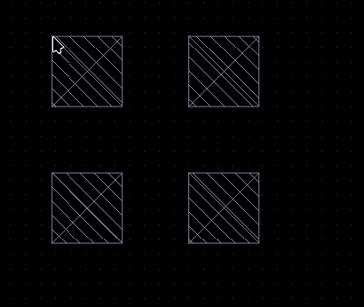

### Create -> Create Polygon... (`G`)

Creates a polygon on the active LSW layer.

- Click to add vertices.
- A temporary guide line shows the next segment.
- Press `Esc` when you are finished.

Polygon properties allow direct point-table editing and layer reassignment.

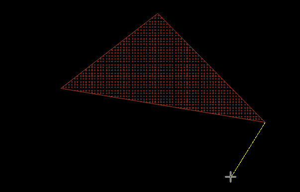

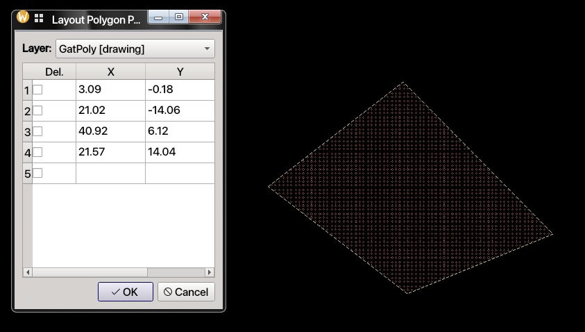

### Create -> Add Ruler (`K`) / Delete Rulers (`Shift+K`)

Rulers are measurement aids drawn in the layout canvas.

- `K` adds a ruler.
- `Shift+K` removes all rulers.

Rulers display measurement ticks and numeric values and follow the layout grid.

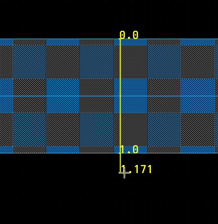

### Options Menu

The layout editor inherits the shared `Options` menu from the editor framework.

- `Options -> Display Config...`: configures major grid spacing, snap grid spacing, and grid
  display style (dots, lines, or no grid). The layout version of this dialog also shows the
  active process resolution as **Process Points per um**. In other words, this field 
  explains how many grids on the layout editor, 1um layout length corresponds to. It can 
  be changed through `Layout Display Options` dialogue as it is a PDK property.

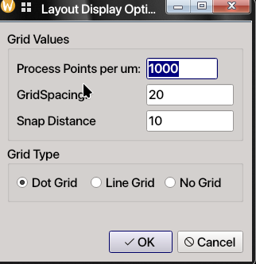

- `Options -> Selection Config...`: configures how box selection works.
  1. `Full`: only items fully enclosed by the selection rectangle are selected.
  2. `Partial`: items intersecting the selection rectangle are also selected.

The layout canvas also includes the **Layer Selection Window (LSW)** at the left side of the
editor. The LSW is not a menu, but it is central to layout editing:

- choose the active drawing layer
- toggle layer visibility
- toggle layer selectability
- quickly make all layers visible / invisible
- quickly make all layers selectable / non-selectable

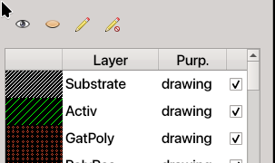

### Check Menu

The base layout editor does not add a mandatory check action by itself, but the active PDK
may populate the `Check` menu with verification commands.

For example, some IHP PDK currently adds **KLayout DRC** to the `Check` menu. 
Treat these as optional, PDK-provided features rather than core layout-editor functionality.

### Tools Menu

- `Tools -> Read Only`: toggles the current layout into read-only mode. While enabled, mouse
  editing events are blocked.
- `Tools -> Renumber Instances`: renumbers layout instances in sequence (`I0`, `I1`, `I2`,
  ...). This operation is saved immediately, reloads the layout afterwards, and is not
  undoable.
- `Tools -> Export GDS`: exports the current layout hierarchy to GDS. The dialog lets you set
  unit, precision, and export directory. Defaults come from the active PDK process settings.

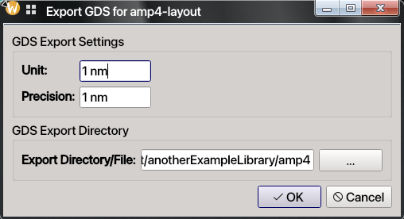

Some PDKs and plugins may also add extra commands to the menu bar or tools area.

## Context Menu (Right-click on Item)

Right-clicking a selected layout item opens a context menu with common edit and hierarchy
actions.

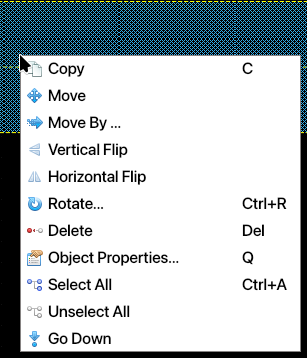

| Action | Shortcut | Notes |
| --- | --- | --- |
| Copy | `C` | Duplicates the selected item(s) for placement. |
| Move | `M` | Starts interactive move mode for the selection. |
| Move By... | None | Opens precise X/Y displacement entry. |
| Vertical Flip | None | Mirrors selected item(s) vertically. |
| Horizontal Flip | None | Mirrors selected item(s) horizontally. |
| Rotate... | `Ctrl+R` | Rotates selected item(s) around a clicked pivot. |
| Delete | `Delete` | Removes selected item(s) from the layout. |
| Object Properties... | `Q` | Opens the object properties dialog. |
| Select All | `Ctrl+A` | Selects all items in the current scene. |
| Unselect All | None | Clears the current selection. |
| Go Down | None | Descends into the selected layout instance. |

Notes:

- `Go Down` is meaningful when a layout instance is selected.
- If an item cannot be selected, check whether its layer is visible and selectable in the
  LSW.

## Layout Shortcuts at a Glance

This quick appendix collects the most frequently used layout shortcuts in one place.

| Shortcut | Action |
| --- | --- |
| `I` | Create instance |
| `R` | Create rectangle |
| `W` | Create path |
| `P` | Create pin |
| `L` | Create label |
| `V` | Create via |
| `G` | Create polygon |
| `K` | Add ruler |
| `Shift+K` | Delete all rulers |
| `Q` | Object properties |
| `M` | Move |
| `C` | Copy |
| `S` | Stretch |
| `Ctrl+R` | Rotate |
| `Shift+A` | Align items |
| `Shift+C` | Cut item |
| `U` | Undo |
| `Shift+U` | Redo |
| `F` | Fit to window |
| `Ctrl+A` | Select all |
| `Z` | Box zoom |
| `Esc` | Cancel current mode and return to selection |

## Final Notes

- The exact list of layers, path types, via types, and PCells depends on the selected PDK.
- Most layout editing is grid-snapped, so typed or dragged coordinates may be adjusted to the
  nearest valid snap point.
- `Q` is the fastest way to make precise edits after placement.
- Use `File -> Update Design` after changing child cells in other windows.
- Use `Esc` whenever you want to abandon the current drawing mode and return to normal
  selection.

Once you are comfortable with the basics above, you can move on to hierarchical layout
assembly, PCell-driven device generation, and PDK-specific verification flows.

