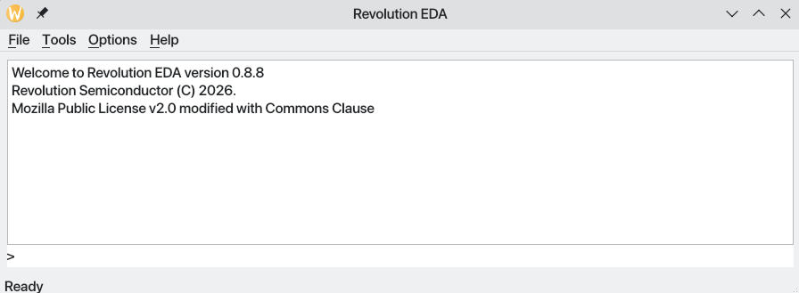
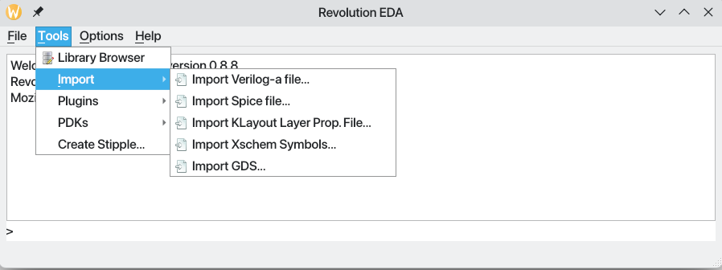
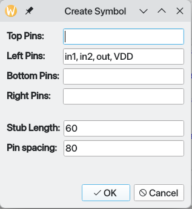
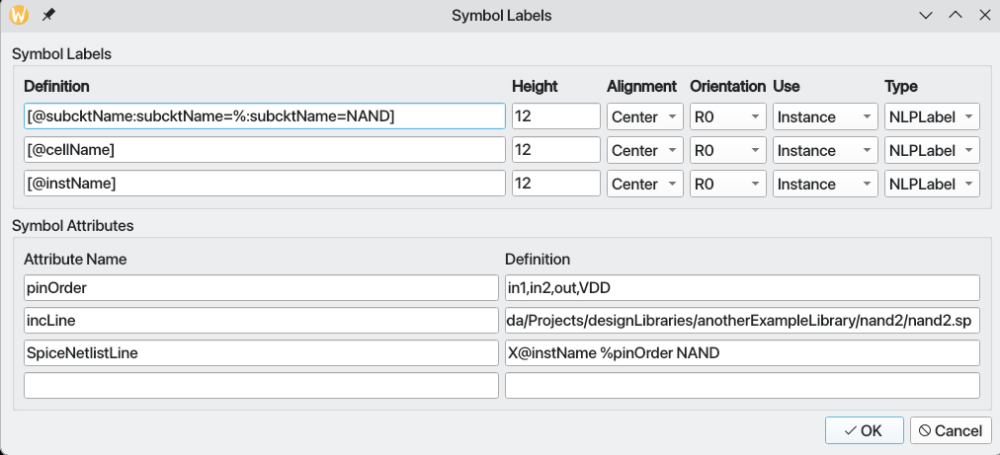

# Revolution EDA Main Window

The Revolution EDA main window is the primary interface for the application. It features a
clean, professional layout with menu-driven access to all major functions and includes an
integrated Python REPL console for advanced scripting and automation.

## Core Features

- **Integrated Python Console**: Full Python REPL with access to Revolution EDA APIs
- **Multi-threaded Architecture**: Efficient background processing with configurable thread
  pool
- **Persistent Configuration**: Automatic saving and restoration of user preferences
- **Plugin Architecture**: Extensible design supporting custom plugins
- **Environment Integration**: Smart path resolution and configuration management

## Menu Structure

The main window provides four primary menus:

### File Menu

- **Exit** (`Ctrl+Q`): Close the application

### Tools Menu

- **Library Browser**: Access the comprehensive library management interface
- **Create Stipple**: Generate custom fill patterns for layout visualization
- **Import Submenu**: Various import utilities for external file formats
    - **Import Verilog-A file...**: Import Verilog-A modules
    - **Import Spice file...**: Import SPICE subcircuits
    - **Import KLayout Layer Prop. File...**: Import layer properties from KLayout
    - **Import Xschem Symbols...**: Import symbols from Xschem
    - **Import GDS...**: Import GDSII layout files

### Options Menu

- **Options...**: Configure application settings, paths, and preferences

### Help Menu

- **Help...**: Access integrated documentation browser
- **About**: Application information and version details

## Environment Configuration

Revolution EDA supports flexible configuration through multiple mechanisms:

### Environment Variables

- **REVEDA_PDK_PATH**: Process Design Kit location for technology files
- **REVEDA_PLUGIN_PATH**: Custom plugin directory location

These can be set in a `.env` file in the Revolution EDA root directory for convenience.

### Configuration Persistence

- Automatic saving of window geometry, thread pool settings, and user preferences
- JSON-based configuration file (`reveda.conf`) for easy editing
- Library definitions stored in `library.json` for session restoration
- Switch view lists and stop view lists are persisted between sessions

### Path Management

- Intelligent path resolution supporting both relative and absolute paths
- Automatic creation of required directories
- Cross-platform compatibility for Windows, macOS, and Linux

### Tools Menu

`Tools` menu has currently three sub-menus: `Import`,  `Library Browser`, and
`Create Stipple`.

### Import Menu

Import Menu is used to import and create symbols for Verilog-a modules and SPICE/Xyce
subcircuits.

#### Verilog-a import

Selecting `Import Verilog-a file…` menu item will display a dialogue
titled `Import a Verilog-a Module File` dialogue. With this dialogue, the user can select,
the
file that has a single Verilog-a module, the library the module will be imported, the cell
name
and cellview name. Note that cell name field is editable, and thus a new cell name can be
input
as well as selecting one of the existing cells. The cellview name field should also be
filled.
The important point is that cellview name should include `veriloga` in the string. If a new
symbol is to be created, `Create a new symbol?` checkbox can be checked. A symbol should be
created to be able to use the Verilog-A module in creation of circuit netlists. Note that
the
veriloga cellview is in fact a JSON file with a link to Verilog-A module file which is
copied to
be under cell directory.

#### Spice Import

Similarly, selecting `Import Spice File…`menu item will lead to a dialogue
titled `Import a Spice Subcircuit File`. Once again, the user can decide if a symbol will be
created for the imported subcircuit. It is advised to create a symbol when the subcircuit is
first imported or the subcircuit pins are changed in any way such as the names or the order.

#### Symbol Creation

While either importing a Verilog-A module or a SPICE subcircuit, a new symbol can be
created. If
the new symbol creation checkbox is checked, a new dialogue for naming the to-be-created
symbol
is displayed:

Once again, the chosen view name should include `symbol` in the string. Click `OK` and now a
new
dialogue to choose pin locations and stub size and the spacing between pins will be
displayed:

Our advice is not to change stub length and pin spacing values between symbols to keep
consistent within a design library. Of course, you could assign subcircuit pins as you see
fit
between top, left, bottom and right sides. A basic symbol is created ready to be edited
further.

This symbol has in this example three attributes [^1]:Attributes will be further explained
in
the symbol editor section.

that is needed for the inclusion of a spice subcircuit in SPICE-like netlist:

1. **SpiceNetlistLine**: This attribute is checked when netlisting the symbol in a
   schematic. It defines the template for the netlisting.
2. **SpectreSymbolNetlistLine**: This attribute is used as a template for netlisting when
   Spectre/Vacask type circuit simulators.
2. **pinOrder**: Pin order defines the order of the pins so that they can replace `@pinList`
   field in `XyceSpiceNetlistLine` in the correct order.
3. **incLine**: The include line is needed so that the simulator can add the subcircuit in
   the
   netlist.

#### Verilog-A module symbol

The following attributes will be added to a symbol created by importing a Verilog-A module:

1. **XyceVerilogaNetlistLine**: This attribute is the template for the netlisting of this
   symbol
   when Verilog-a cellview is used.
2. **pinOrder**: Pin order defines the order of pins that replaces `@pinList` field
   in `XyceVerilogaNetlistLine` attribute.
3. **vaModelLine**: This is added to the netlist to define the model for this particular
   symbol.
   More than one Verilog-A model can refer to same module
   with different model parameters.
4. **vaHDLLine**: This is an extension to Xyce netlist format devised by Revolution EDA. It
   will
   include a line in final simulation deck that starts with `*.HDL` and points
   to Verilog-A module file location.

Furthermore, this symbol has an attribute that will be used as a model parameter.

1. **td**. An example model parameter can be seen in this particular example, i.e. *td*.
   Depending on whether the parameter is denoted with
   `(*type = "instance", xyceAlsoModel = "yes" *)` in module body, this can be also an
   instance
   parameter. A user might possibly copy this symbol to another cell/cellview with another
   model
   parameter attribute value and model name to create another model.

### Library Browser

A typical user will be regularly interacting with `Library Browser` to access design data
files.
Library Browser is used to create, open and delete libraries, create, copy and rename cells
and
cellviews. Note that Revolution EDA does not have a central database structure. Each library
is
in its folder and each cell is a sub-folder under the library folder. Each cellview is a
file in
the cell folder. Library folders are denoted by an empty `reveda.lib` file. Library browser
window is designed to be familiar to the experienced custom integrated circuit designers.

Library Browser menubar includes four menus:

1. `Library` This menu has again four items: `Create/Open Lib…`, `Library Editor`,
   `Close Lib…`,
   and `Update Library…`

    1. A library can be created using `Create/Open Lib...` dialogue, which will open a file
       browser. An
       existing library can be selected or a new folder can be created. Revolution EDA will
       create
       a `reveda.lib` file to denote that it is a valid library. At the moment, it is an
       empty
       file.
    2. `Library Editor` dialogue can be used to open existing design libraries as well as
       saving
       library paths in a `library.json` file so that the next time Revolution EDA is
       started
       the user
       will not have to open the libraries again.
    3. `Close Lib` dialogue is used to close a design library.
    4. `Update Library` will rescan the library paths to reconstruct the

2. `Cell` menu item has two items:

    1. `New Cell…` is used to create a new cell. It starts a dialogue to choose the library
       cell
       will be placed and its name. In the file system, it creates an empty folder under the
       library folder.
    2. `Delete Cell…` starts a dialogue to choose which cell will be deleted. When a cell is
       deleted, its child cellviews are also deleted. This is not reversible unless a
       revision
       control system is in place.

3. `View` menu item has three items:

    1. `Create New CellView...` dialogue is used to create a new cell view.

       

       The following cellviews are functional at the moment:

       | Cellview | Tool |
       |------------|----------------------------------------------------||
       | schematic | Schematic Editor |
       | symbol | Symbol Editor |
       | config | Config Editor |
       | veriloga | Text Editor (opens associated Verilog-A file)      |
       | pcell | Text Editor (JSON-based parametric cell reference) |
       | spice | Text Editor (opens associated SPICE file)          |
       | layout | Layout Editor |
       | revbench | Simulation & Analysis Environment (requires revedasim plugin) |

    2. `Open CellView...` menu item is used to the start the relevant tool for a cellview.

    3. `Delete CellView…` menu item is used to delete a cellview.

       Both of these items will lead to a dialogue to select the right cellview:

        

#### View Options

Library Browser now supports multiple view modes:

- **Column View**: Traditional three-column layout for libraries, cells, and views
- **Tree View**: Hierarchical tree structure for compact navigation

#### Contextual Menus

## Python Console Integration

The integrated Python console provides:

- Full access to Revolution EDA's internal APIs
- Real-time feedback and logging integration
- Support for custom automation scripts
- Interactive debugging capabilities

## Thread Pool Management

Revolution EDA uses a sophisticated threading system:

- Configurable maximum thread count (defaults to CPU core count)
- 30-second expiry timeout for efficient resource management
- Background processing for import/export operations
- Graceful shutdown with proper thread cleanup

## Import Tools

The Import submenu provides comprehensive support for external file formats:

### Verilog-A Import

- Import Verilog-A modules with automatic symbol generation
- Support for model and instance parameters
- Integrated with Xyce simulator netlisting

### SPICE Import

- Import SPICE subcircuits with symbol creation
- Automatic pin order detection and netlisting templates
- Support for hierarchical designs

### Layout Import

- **KLayout Layer Properties**: Import layer definition files
- **Xschem Symbols**: Convert Xschem symbol files
- **GDS Import**: Import GDSII layout files with configurable units

## Plugin Architecture

Revolution EDA features a modular plugin architecture that enables extensible functionality:

### Available Plugins

- **revedasim**: Simulation and Analysis Environment with Xyce integration
- **revedaplot**: High-performance waveform viewer and plotter

### Plugin Configuration

- Plugins are automatically discovered from the `REVEDA_PLUGIN_PATH` directory
- Set the plugin path via environment variable or the Options dialog
- Plugins extend menus and functionality dynamically when loaded

## Configuration Management

The Options dialog provides comprehensive configuration:

- **Path Settings**: Configure PDK, output, and plugin paths
- **View Lists**: Define switch and stop view hierarchies for netlisting
- **Thread Pool**: Adjust maximum thread count for performance tuning (defaults to CPU core
  count)
- **Persistence**: Option to save settings automatically in `reveda.conf`

There are also contextual menus defined for library, cell and cellview items in the Library
Browser. Selecting an item and clicking right mouse button will display the relevant
menu.ets/Screenshot_20230214_213352.png"  class="small-image" />

Their function are the same as the relevant menu item under `Library` menu.

