# Revolution EDA Main Window

The Revolution EDA main window is the primary interface for the application. It features a
clean, professional layout with menu-driven access to all major functions and includes an
integrated Python REPL console for advanced scripting and automation.

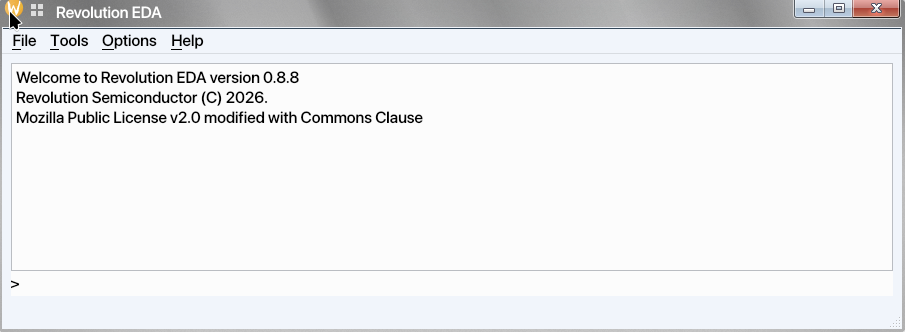

## Core Features

- **Integrated Python Console**: Full Python REPL with access to Revolution EDA APIs
- **Multi-threaded Architecture**: Efficient background processing with configurable thread
  pool
- **Persistent Configuration**: Automatic saving and restoration of user preferences
- **Plugin Architecture**: Extensible design supporting custom plugins
- **Environment Integration**: Smart path resolution and configuration management

We will now review the functionalities that can be accessed through menus.

## Tools Menu

`Tools` menu has several sub-menus and items:  `Library Browser`, `Plugins`, `Libraries`, `PDKs`, `Import` and `Create Stipple`.

### Library Browser

A typical user will be regularly interacting with `Library Browser` to access design data
files.
Library Browser is used to create, open and delete libraries, create, copy and rename cells
and
cellviews. Note that Revolution EDA does not have a central database structure. Each library
is
in its folder and each cell is a sub-folder under the library folder. Each cellview is a
file is a JSON formatted in
the cell folder. Library folders are denoted by an empty `reveda.lib` file. Library browser
window is designed to be familiar to the experienced custom integrated circuit designers.

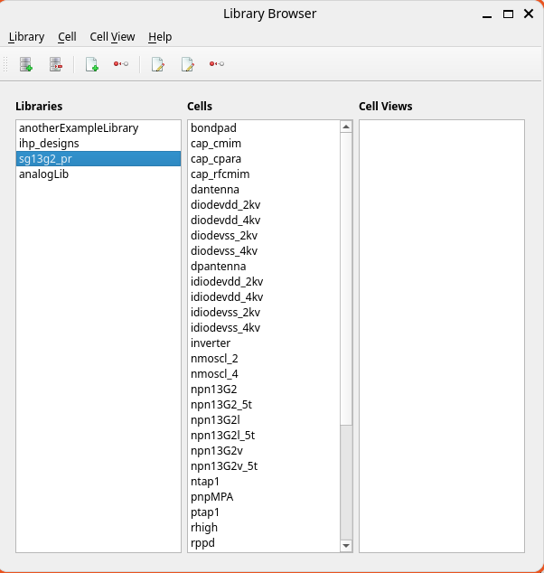

**Library Browser** menubar includes four menus:

1. `Library` This menu has again four items: `Create/Open Lib…`, `Library Editor`,
   `Close Lib…`,
   and `Update Library…`

   1. A library can be created using `Create/Open Lib...` dialogue, which will open a file
      browser. An
      existing library can be selected or a new folder can be created. Revolution EDA will
      create
      a `reveda.lib` file to denote that it is a valid library. At the moment, it is an
      empty
      file.
   2. `Library Editor` dialogue can be used to open existing design libraries as well as
      saving
      library paths in a `library.json` file so that the next time Revolution EDA is
      started
      the user
      will not have to open the libraries again.
   3. `Close Lib` dialogue is used to close a design library.
   4. `Update Library` will rescan the library paths to reconstruct the library browser content.
   5. `Update Library Refs...` dialogue is used to update references in a library.

   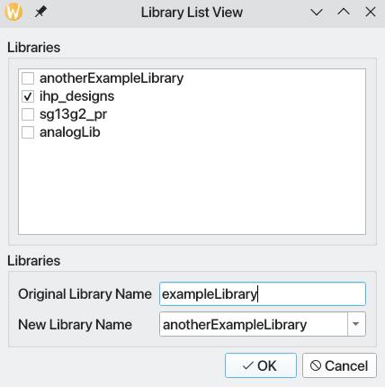

2. `Cell` menu item has two items:

   1. `New Cell…` is used to create a new cell. It starts a dialogue to choose the library
      cell
      will be placed and its name. In the file system, it creates an empty folder under the
      library folder. 

        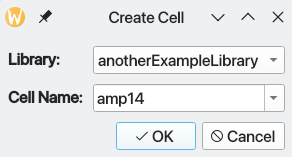

   2. `Delete Cell…` starts a dialogue to choose which cell will be deleted. When a cell is
      deleted, its child cellviews are also deleted. This is not reversible unless a
      revision
      control system is in place.

3. `View` menu item has three items:

   1. `Create New CellView...` dialogue is used to create a new cell view.

      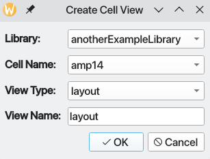

      The following cellviews are functional at the moment:

      | Cellview  | Tool                                                         |
      | --------- | ------------------------------------------------------------ |
      | schematic | Schematic Editor                                             |
      | symbol    | Symbol Editor                                                |
      | config    | Config Editor                                                |
      | veriloga  | Text Editor (opens associated Verilog-A file)                |
      | pcell     | Text Editor (JSON-based parametric cell reference)           |
      | spice     | Text Editor (opens associated SPICE file)                    |
      | layout    | Layout Editor                                                |
      | revbench  | Simulation & Analysis Environment (requires revedasim plugin) |

   2. `Open CellView...` menu item is used to the start the relevant tool for a cellview.

   3. `Delete CellView…` menu item is used to delete a cellview.

      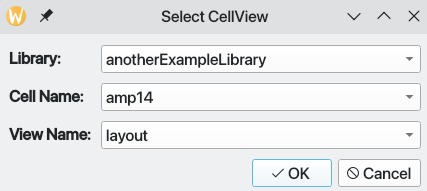

#### Contextual Menus

The Library Browser provides context-sensitive menus when right-clicking on items in the three main lists:

**Libraries List Context Menu** (right-click on a library):

- **Rename Library**: Rename the selected library
- **Remove Library**: Remove the library from the browser (does not delete files)
- **Create Cell**: Create a new cell in the selected library
- **File Information...**: Display file system information about the library

**Cells List Context Menu** (right-click on a cell):

- **Create CellView...**: Create a new cellview (schematic, symbol, layout, etc.) for the cell
- **Copy Cell...**: Copy the cell to another library or rename within the same library
- **Rename Cell...**: Rename the selected cell
- **Delete Cell...**: Delete the cell and all its cellviews
- **File Information...**: Display file system information about the cell

**Views List Context Menu** (right-click on a cellview):

- **Open View**: Open the cellview in the appropriate editor
- **Copy View...**: Copy the cellview to create a new version
- **Rename View...**: Rename the cellview
- **Delete View...**: Delete the cellview
- **File Information...**: Display file system information about the cellview

### Import Submenu

Import Menu is used to import and create symbols for Verilog-a modules and SPICE/Xyce
subcircuits.

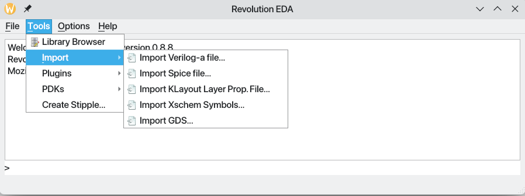

#### Verilog-a import

Selecting `Import Verilog-a file…` menu item will display a dialogue
titled `Import a Verilog-a Module File` dialogue. With this dialogue, the user can select,
the
file that has a single Verilog-a module, the library the module will be imported, the cell
name
and cellview name. Note that cell name field is editable, and thus a new cell name can be
input
as well as selecting one of the existing cells. The cellview name field should also be
filled.
The important point is that cellview name should include `veriloga` in the string. If a new
symbol is to be created, `Create a new symbol?` checkbox can be checked. A symbol should be
created to be able to use the Verilog-A module in creation of circuit netlists. Note that
the
veriloga cellview is in fact a JSON file with a link to Verilog-A module file which is
copied to
be under cell directory.

#### Spice Import

Similarly, selecting `Import Spice File…`menu item will lead to a dialogue
titled `Import a Spice Subcircuit File`. Once again, the user can decide if a symbol will be
created for the imported subcircuit. It is advised to create a symbol when the subcircuit is
first imported or the subcircuit pins are changed in any way such as the names or the order.

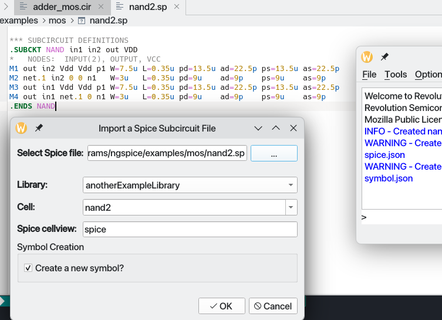

#### Symbol Creation

While either importing a Verilog-A module or a SPICE subcircuit, a new symbol can be
created. If
the new symbol creation checkbox is checked, a new dialogue for naming the to-be-created
symbol
is displayed:

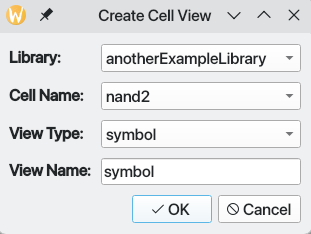

Once again, the chosen view name should include `symbol` in the string. Click `OK` and now a
new
dialogue to choose pin locations and stub size and the spacing between pins will be
displayed:

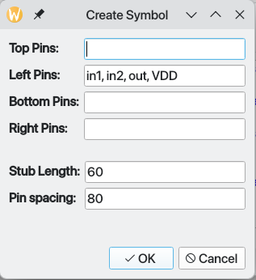

Our advice is not to change stub length and pin spacing values between symbols to keep
consistent within a design library. Of course, you could assign subcircuit pins as you see
fit
between top, left, bottom and right sides. A basic symbol is created ready to be edited
further.

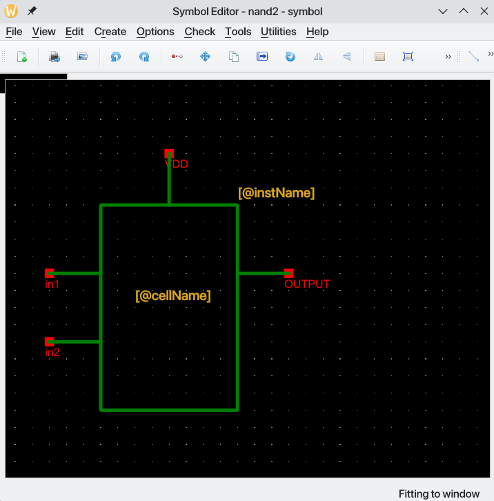

This symbol has in this example three attributes [^1]:Attributes will be further explained
in
the symbol editor section.

that is needed for the inclusion of a spice subcircuit in SPICE-like netlist:

1. **SpiceNetlistLine**: This attribute is checked when netlisting the symbol in a
   schematic. It defines the template for the netlisting.
2. **SpectreNetlistLine**: This attribute is used as a template for netlisting when
   Spectre/Vacask type circuit simulators.
3. **pinOrder**: Pin order defines the order of the pins so that they can replace `%pinOrder`
   field in `SpiceNetlistLine` in the correct order.
4. **incLine**: The include line is needed so that the simulator can add the subcircuit in
   the
   netlist.

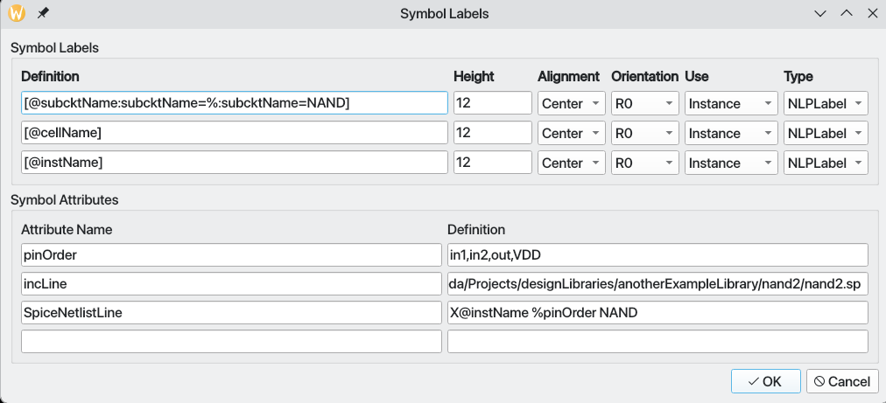

#### Verilog-A module symbol

The following attributes will be added to a symbol created by importing a Verilog-A module:

1. **SpiceNetlistLine**: This attribute is the template for the netlisting of this
   symbol
   when Verilog-a cellview is used.
2. **pinOrder**: Pin order defines the order of pins that replaces `%pinOrder` field
   in `SpiceNetlistLine` attribute.
3. **vaModelLine**: This is added to the netlist to define the model for this particular
   symbol.
   More than one Verilog-A model can refer to same module
   with different model parameters.
4. **vaHDLLine**: This is an extension to Xyce netlist format devised by Revolution EDA. It
   will
   include a line in final simulation deck that starts with `*.HDL` and points
   to Verilog-A module file location.

Furthermore, this symbol has an attribute that will be used as a model parameter.

1. **td**. An example model parameter can be seen in this particular example, i.e. _td_.
   Depending on whether the parameter is denoted with
   `(*type = "instance", xyceAlsoModel = "yes" *)` in module body, this can be also an
   instance
   parameter. A user might possibly copy this symbol to another cell/cellview with another model
   parameter attribute value and model name to create another model.

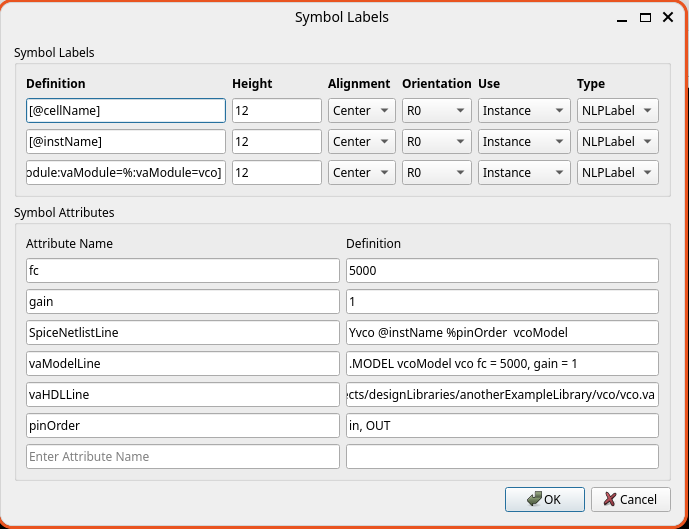

### Plugins Submenu

The Plugins submenu allows users to manage and configure plugins that extend Revolution EDA's functionality. Revolution EDA plugins can be source and/or binary. A company could decide to create its own plugin store to distribute its internally developed plugins.

#### Setup Plugins

Selecting `Setup Plugins...` opens the Plugin Registry window where users can:

- View installed plugins
- Install new plugins
- Uinstall installed plugins

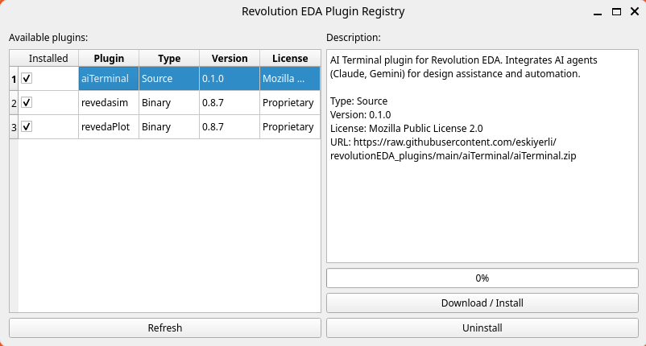

### Libraries Submenu

The Libraries submenu provides tools for managing design libraries.

#### Setup Libraries

Selecting `Setup Libraries` opens the Library Registry window for:

- Selecting library prefix paths to organise library installation.
- Installing third party libraries.
- Uninstalling libraries installed using library registry.

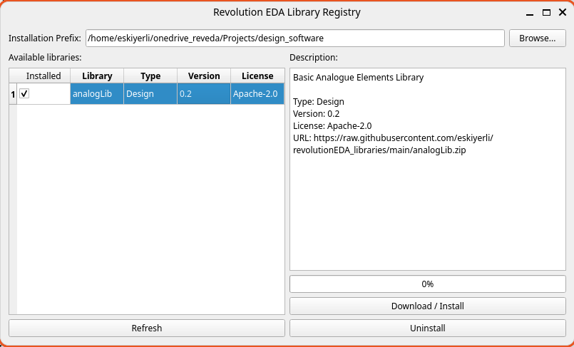

### PDKs Submenu

The PDKs submenu is used to manage Process Design Kits (PDKs) for different technologies.

#### Setup PDK

Selecting `Setup PDK...` opens the PDK Registry window to:

- Download and install source or binary PDKs.
- Uninstall PDKs installed through PDK registry.

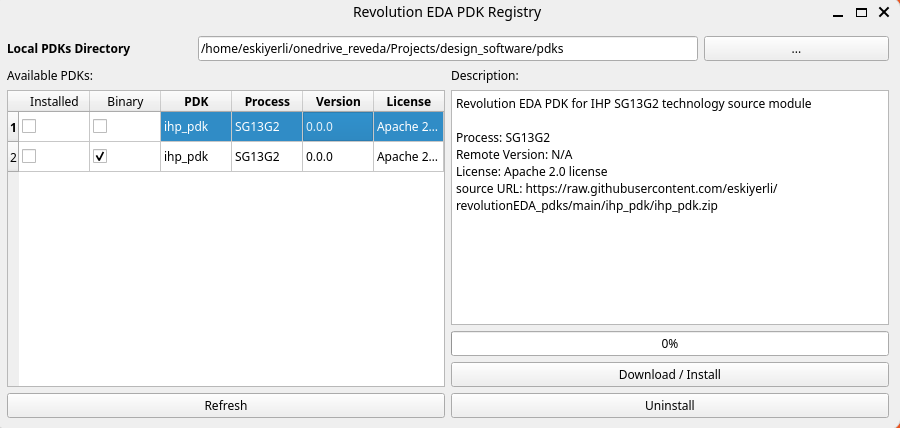

### Create Stipple Submenu

The `Create Stipple` tool allows users to generate custom fill patterns for layout visualization. This is useful for creating stipple patterns used in layout editors for different layers or regions.

Selecting `Create Stipple...` opens the Stipple Editor where users can:

- Design custom stipple patterns
- Save patterns for reuse in layouts

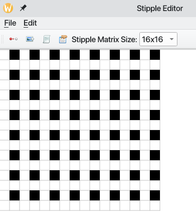

## Options Menu
The `Options` menu provides access to the application settings and configuration management:

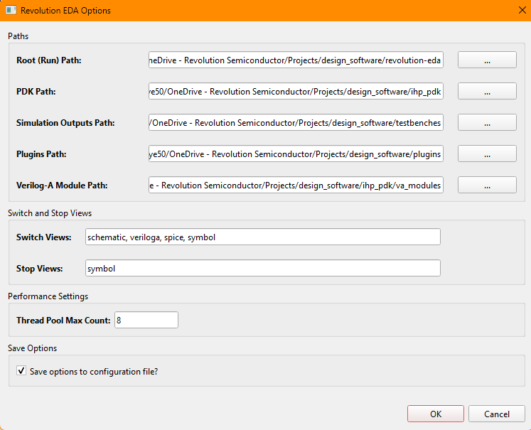

## Path Settings

- **Root (Run) Path**: This is the root path of the Revolution EDA installation.
- **PDK Path**: Configure the Process Design Kit directory (can be set via `REVEDA_PDK_PATH` environment variable or `.env` file)
- **Simulation Outputs Path**: Set default directory prefix for simulation exports and generated files.
- **Plugins Path**: Specify custom plugin directory location (can also be set via `REVEDA_PLUGIN_PATH` environment variable)

## View Lists

- **Switch View List**: Define the preference order for netlisting traversal (e.g., "schematic" → "symbol")
- **Stop View List**: Specify views where netlisting should halt (e.g., "symbol" to prevent further descent)

## Thread Pool Configuration

- **Maximum Thread Count**: Adjust the number of background threads for parallel processing (defaults to CPU core count)
- **Thread Expiry Timeout**: Set timeout for thread cleanup (fixed at 30 seconds)

## Persistence Options

- **Save options to configuration file**: Toggle automatic saving of configuration changes to `reveda.conf`

The dialog supports cross-platform path resolution with both relative and absolute paths, and changes take effect immediately or after application restart as needed. Settings are stored in JSON format for easy manual editing if required.

### Help Menu

- **Help...**: Access integrated documentation browser
- **About**: Application information and version details

## Environment Configuration

Revolution EDA supports flexible configuration through multiple mechanisms:

### Environment Variables

- **REVEDA_PDK_PATH**: Process Design Kit location for technology files
- **REVEDA_PLUGIN_PATH**: Custom plugin directory location

These can be set in a `.env` file in the Revolution EDA root directory for convenience.

## Thread Pool Management

Revolution EDA uses a sophisticated threading system:

- Configurable maximum thread count (defaults to CPU core count)
- 30-second expiry timeout for efficient resource management
- Background processing for import/export operations
- Graceful shutdown with proper thread cleanup

### Plugin Configuration

- Plugins are automatically discovered from the `REVEDA_PLUGIN_PATH` directory
- Set the plugin path via environment variable or the Options dialog
- Plugins extend menus and functionality dynamically when loaded.

More information on plugins within Revolution EDA can be found in [Plugins Documentation](./plugins.md).

## Python Console Integration

The integrated Python console provides:

- Full access to Revolution EDA's internal APIs
- Real-time feedback and logging integration
- Support for custom automation scripts
- Interactive debugging capabilities

