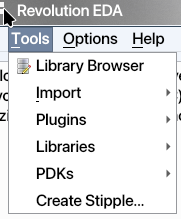
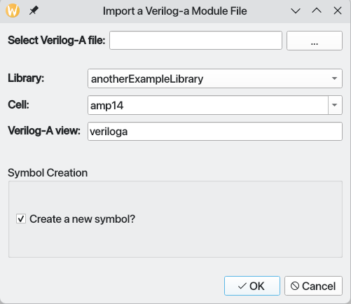

dialogue to choose pin locations and stub size and
the spacing between pins will be

displayed:
the symbol editor section.
# Revolution EDA Main Window

The main window is the starting point for Revolution EDA. It gives you access to the Library
Browser, import tools, plugin and PDK setup, application options, and an integrated Python
console area that shows startup messages and logging output.


## Quick Orientation

- The main window is intentionally simple: most editing happens in the schematic, symbol,
  layout, and config editors opened from the Library Browser.
- The central area includes an integrated **Python console**.
- The menu bar is focused on application setup rather than geometry editing.
- The **Tools** menu is where you will spend most of your time when setting up a working
  environment.

## Typical Startup Flow

1. Launch Revolution EDA from the project directory, or use `--project <path>`.
2. The application loads `.env`, library definitions, and saved state from the project.
3. Open the **Library Browser** from `Tools -> Library Browser`.
4. Create or open a library.
5. Create a cell and then create or open a cellview such as `schematic`, `symbol`, or
   `layout`.
6. If needed, configure PDKs, plugins, and library registries from the main window menus.
7. To switch to a different project, use `File -> Open Project...` or `File -> Recent
   Projects` — the application will restart cleanly with the new configuration.

## Menu Actions You Will Use Most

### File Menu

The main window File menu manages project-level operations and application lifecycle.

- `File -> Open Project...`: Opens a project directory and restarts the application to load
  the new project's configuration cleanly.
- `File -> Recent Projects`: Lists the most recently opened project directories (up to 5).
  Selecting an entry restarts the application pointing at that project.
- `File -> Exit`: Closes the application.

| Action | Shortcut | Notes |
| --- | --- | --- |
| `File -> Open Project...` | `Ctrl+Shift+O` | Opens a project directory (triggers restart). |
| `File -> Recent Projects` | — | Quick access to previously opened projects. |
| `File -> Exit` | `Ctrl+Q` | Closes Revolution EDA. |

#### Project Management

Revolution EDA uses a **project directory** concept. A project directory contains:

- `.env` — environment variables (PDK path, plugin path, VA module path)
- `library.json` — library definitions for the project
- `reveda.conf` — saved application state (window geometry, view lists, thread pool settings)

**How project loading works:**

1. On startup, Revolution EDA opens the project directory specified by the `--project`
   command-line argument, or the current working directory if no argument is given.
2. The `.env` file is loaded (copied from `.env.example` if missing), setting paths for
   PDK, plugins, and other resources.
3. Library definitions are loaded from `library.json`.
4. Application state is restored from `reveda.conf`.

**Switching projects:**

When you select a different project directory via `File -> Open Project...` or the
`Recent Projects` menu, the application **saves the current project state and restarts**
with the new project directory. This guarantees that PDKs, plugins, and all imported modules
are loaded cleanly without stale state from the previous project.

**Recent projects** are persisted in `~/.reveda/reveda_settings.ini` and survive application
restarts.

**Command-line usage:**

```bash
# Open a specific project directory
reveda --project /path/to/my/project

# Or simply run from the project directory
cd /path/to/my/project
reveda
```

### Tools Menu

The Tools menu is the main control center of the application.

Most actions in this menu open a dedicated window or dialog rather than directly modifying
the current design. In practice, `Tools` is where you configure application resources,
import external design data, and launch utility editors that support the main schematic,
symbol, and layout workflows.



It includes the following menu items:

- `Library Browser`
- `Import`
- `Plugins`
- `Libraries`
- `PDKs`
- `Create Stipple...`

#### Library Browser

The Library Browser is the main user workspace for opening and organizing design data.


From the Library Browser, users typically:

- create or open libraries
- create, rename, copy, or delete cells
- create, open, copy, rename, or delete cellviews

It is also the normal entry point into the actual editors. Once a library and cell exist,
you usually open a cellview from here and continue your work in the schematic, symbol,
layout, or config window associated with that view.

In day-to-day use, think of the Library Browser as the design-data manager for the whole
project: it shows the available libraries, their cells, and the set of cellviews stored in
each cell.

Implemented cellview types include but not limited to:

| Cellview | Tool |
| --- | --- |
| `schematic` | Schematic Editor |
| `symbol` | Symbol Editor |
| `layout` | Layout Editor |
| `config` | Config Editor |
| `veriloga` | Text editor / linked Verilog-A flow |
| `spice` | Text editor / linked SPICE flow |
| `pcell` | Text editor / PCell reference flow |
| `revbench` | Simulation environment (when available) |


#### Import Submenu

The Import submenu is used to bring design data in various formats into Revolution EDA.


Available import actions include:

- `Import Verilog-a file...`
- `Import Spice file...`
- `Import KLayout Layer Prop. File...`
- `Import Xschem Symbols...`
- `Import GDS...`

These actions are used to build libraries, symbols, and layouts from external sources.

The import tools serve different purposes:

- `Import Verilog-a file...`: imports a Verilog-A module into a library/cell as a Verilog-A
  view. This flow is useful when you already have behavioral model source and want to add it
  to a design library. The import dialog can also create a symbol for the module.


If `Create a new Symbol` checkbox is checked, a new symbol for Verilog-A module will be
generated. You will be able to determine the pin locations and stub size in the symbol editor after import.


Generated symbol will have the correct attributes set for successful netlisting and 
simulation with Xyce simulator.


- `Import Spice file...`: imports a SPICE subcircuit into a selected library/cell as a SPICE
  view. Like the Verilog-A flow, this is a convenient way to seed a design library from an
  existing netlist and optionally create a matching symbol.


If `Create a new Symbol` checkbox is checked, a new symbol for SPICE subcircuit will be 
generated:


Symbol for imported Spice file will have symbol attributes generated for successful 
netlisting with SPICE like simulators.


- `Import KLayout Layer Prop. File...`: converts a KLayout `.lyp` layer-properties file into
  Revolution EDA layer-definition output. This is mainly a technology-setup helper when you
  want to reuse an existing KLayout layer/color description as a starting point.
- `Import Xschem Symbols...`: imports one or more Xschem `.sym` symbol files into a selected
  library. The dialog lets you choose the destination library and a scale factor, so this
  tool is especially useful when migrating symbol sets from an Xschem-based flow.
- `Import GDS...`: imports geometry from a GDS file into a dedicated Revolution EDA library.
  The dialog asks for a target library name plus GDS unit and precision values, making it a
  practical bridge from external layout data into native layout cellviews.

Practical notes:

- Use imports as starting points, not as a guarantee of perfect one-to-one translation.
- For symbol and layout imports, it is often worth opening the generated result afterward to
  check scaling, layers, labels, and hierarchy.
- The GDS import dialog defaults the target library name to `importLib`, which is useful for
  keeping imported layout data separate from other design libraries.

<!-- Screenshot placeholder: Import submenu and import dialogs -->

#### Plugins Submenu

`Tools -> Plugins -> Setup Plugins...` opens plugin management for installed or available
plugins.

The plugin registry window shows available plugins, whether each one is already installed,
and basic metadata such as type, version, and license. It will check the 
`REVEDA_PLUGIN_PATH` environment variable if it is already set or `Plugins Path`  from 
Options Dialogue if it set there separately.


From `Revolution EDA Plugin Registry` dialogue, you can:

- refresh the registry listing
- inspect plugin descriptions
- download and install a plugin
- uninstall an installed plugin

In normal use, this is the preferred way to add optional capabilities such as simulation,
plotting, or AI-assisted tools. After installing or uninstalling plugins, restarting the
application is the safest way to ensure menu integrations are reloaded cleanly.

For more detail, see [Plugins](./plugins.md).

#### Libraries Submenu

`Tools -> Libraries -> Setup Libraries` opens the library registry and installation tools.


This window is used to browse downloadable design libraries and install them into a chosen
installation prefix. It shows whether a listed library is already installed, provides a
description panel, and supports refresh, install, and uninstall operations.

Unlike the Library Browser, which manages the libraries already visible in your working
environment, the library registry is focused on acquiring library content. When a library is
installed from this window, Revolution EDA also updates the active library definitions so the
new library becomes available in the Library Browser.

#### PDKs Submenu

`Tools -> PDKs -> Setup PDK...` opens the PDK management flow.


The PDK registry window lets you browse available PDK packages, view process and version
information, choose the local PDK storage directory, and install or uninstall PDKs. The list
also indicates whether an entry is source or binary and can show when an installed PDK has a
newer version available.

This tool is mainly about obtaining and maintaining local PDK packages. Selecting which PDK
the application actively uses is still handled through application configuration such as the
Options dialog or environment variables like `REVEDA_PDK_PATH`.

#### Create Stipple

`Tools -> Create Stipple...` opens the stipple editor used for layout fill-pattern design.

This is a small utility editor for creating or adjusting stipple patterns used in layout
display and related layer-visualization workflows. You typically use it when defining custom
fill appearances rather than while editing device geometry directly.


### Options Menu

`Options -> Options...` opens the main application settings dialog.

This is where you configure application-level paths and defaults such as:

- run/root path
- PDK path
- simulation output path
- plugins path
- Verilog-A module path
- switch view list
- stop view list
- thread-pool size

Important environment-related paths may also be provided through environment variables such as:

- `REVEDA_PDK_PATH`
- `REVEDA_PLUGIN_PATH`
- `REVEDA_VA_MODULE_PATH`


### Help Menu

The Help menu contains:

- `Help...`
- `About`

Use these actions to open the integrated help browser or view application information.

## Main Window Concepts

### Integrated Python Console

The main window embeds a Python console widget that shows welcome text and logging output.
This makes the main window useful for diagnostics, scripting experiments, and observing
application messages.

### Thread Pool and Background Work

Revolution EDA uses a shared thread pool for background work. The thread count is configured
at application level and exposed through the Options dialog.

### Plugin and PDK Integration

Plugins and PDKs can extend application behavior, menus, and downstream flows. Their setup is
managed from the main window rather than from the individual drawing editors.

## Final Notes

- Think of the main window as the **launch and configuration hub** for the application.
- Think of the Library Browser as the **entry point to actual design data**.
- Once your libraries and PDK are configured, most day-to-day design work moves into the
  editor windows rather than the main window itself.

For the next step in a typical workflow, continue with:

- [Installation](./installation.md)
- [Schematic Editor Tutorial](./schematicTutorial.md)
- [Symbol Editor Tutorial](./symbolTutorial.md)
- [Layout Editor Tutorial](./layoutTutorial.md)

