# Revolution EDA Schematic Editor

This guide targets designers already familiar with legacy circuit schematic capture tools (for example Cadence Virtuoso).
Revolution EDA follows the same core workflow: place instances, wire, annotate, define pins, generate symbols, and netlist/simulate at **zero cost** and **full access to source code** without having to worry about software licence fees.

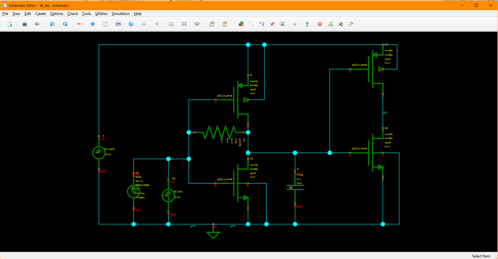

## Quick Orientation (for Virtuoso Users)

- **Library Browser**: similar to a library manager; open schematic cellviews from the library browser.
- **Instance Placement**: press `i` to place symbols; `q` opens the instance properties.
- **Wiring**: press `w` to draw orthogonal wires. Wires snap to pins, auto-merge with other overlapping nets, and form junction dots when two nets are orthogonal and one ends on the other. When a junction dot is created, one of the nets might be split at that point.
- **Pins**: press `p` to create schematic pins (for hierarchy and symbol generation).
- **Hierarchy**: `Go Down` and `Go Up` behave like standard hierarchical editing.
- **Netlisting/Simulation**: accessible from `Simulation` menu; supports switch/stop lists and config views.


## Virtuoso to Revolution EDA Mapping

The table below maps common Virtuoso schematic actions to Revolution EDA equivalents.

| Virtuoso Action | Revolution EDA Equivalent | Notes |
| --- | --- | --- |
| Add instance | `Create -> Instance...` or press `i` | Select symbol view, then click to place |
| Edit properties | Select item and press `q` | Instance, pin, wire, or text |
| Wire | `Create -> Wire` or press `w` | Orthogonal wiring, auto-junctions |
| Place pin | `Create -> Pin` or press `p` | Direction: Input/Output/InOut |
| Net label | `Net Properties` on selected wire or press 'l' | Names propagate along connected net |
| Highlight net | `Tools -> Highlight Net` | Hover to highlight connected net |
| Go down hierarchy | `Edit -> Hierarchy -> Go Down` or `Shift+E` | Choose schematic or symbol |
| Go up hierarchy | `Edit -> Hierarchy -> Go Up` | Returns to parent view |
| Generate symbol | `Create -> Create Symbol...` | Uses schematic pins |
| Create netlist | `Simulation -> Create Netlist...` | Switch/stop lists supported |
| Run simulation | `Simulation -> Simulation Environment...` | Requires `revedasim` plugin |

## Typical Design Flow

1. Create or open a schematic view from the Library Browser.
2. Place instances with `Create -> Instance...`.
3. Wire the circuit with `Create -> Wire`.
4. Add pins for hierarchy and symbol generation with `Create -> Pin`.
5. Annotate with text labels as needed.
6. Generate a symbol using `Create -> Create Symbol...`.
7. Netlist or run simulation via `Simulation` menu.

<!-- Screenshot: Typical design flow overview -->

## Menu Actions You Will Use Most

This section summarizes the most common schematic editor actions by menu.


### File Menu

The File menu handles saving, printing, and exporting your schematic designs.

- `File -> Check-Save`: validates the schematic and saves it to disk.
- `File -> Save`: saves the current schematic without validation.
- `File -> Update Design`: reloads all referenced cells from disk, useful after external changes.
- `File -> Print...`: opens a print dialog to send the schematic to a printer.
- `File -> Print Preview...`: shows a preview of how the schematic will appear when printed.
- `File -> Export...`: exports the schematic as an image file (PNG, JPEG, etc.).
- `File -> Close Window`: closes the current editor window.

File menu actions and shortcuts:

| Action | Shortcut | Notes |
| --- | --- | --- |
| `File -> Check-Save` | None | Validates design rules before saving. |
| `File -> Save` | None | Quick save without validation. |
| `File -> Update Design` | None | Refreshes all cell references from disk. |
| `File -> Print...` | None | Standard print dialog with page setup. |
| `File -> Print Preview...` | None | Preview print output before printing. |
| `File -> Export...` | None | Export as image for documentation. |
| `File -> Close Window` | `Ctrl+Q` | Closes the editor; prompts to save if unsaved changes. |

### View Menu

The View menu controls how you see and navigate your schematic.

- `View -> Fit to Window`: zooms and pans to show the entire schematic.
- `View -> Zoom In`: increases magnification for detailed work.
- `View -> Zoom Out`: decreases magnification to see more of the design.
- `View -> Pan View`: enables mouse-based panning of the view.
- `View -> Redraw`: refreshes the display, useful if rendering issues occur.

View menu actions and shortcuts:

| Action | Shortcut | Notes |
| --- | --- | --- |
| `View -> Fit to Window` | `F` | Fits entire design in view. |
| `View -> Zoom In` | None | Step zoom in; use mouse wheel for continuous zoom. |
| `View -> Zoom Out` | None | Step zoom out; use mouse wheel for continuous zoom. |
| `View -> Pan View` | None | Click and drag to pan; middle mouse button also pans. |
| `View -> Redraw` | None | Forces screen refresh. |

### Edit Menu

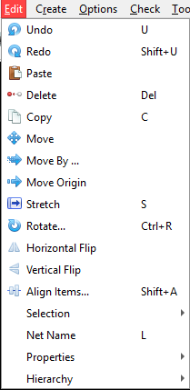


- `Edit -> Net Name`: Enter the net name string in the dialogue and then select a net to set its name.
- `Edit -> Properties -> Object Properties`: inspect or edit properties for the selection. Depending on the instance, the use also can inspect the instance attributes for the instance, but not edit them.
	<table>
		<tr>
			<td>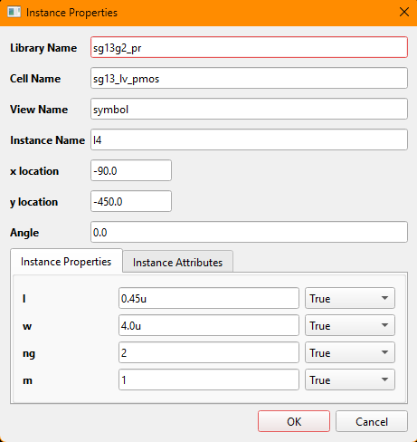</td>
			<td>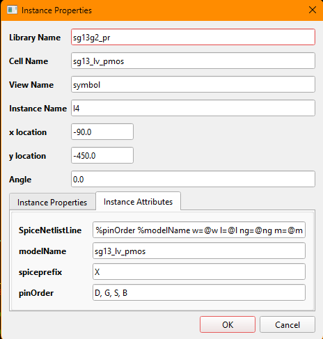</td>
		</tr>
	</table>
- `Edit -> Move`: move selected items interactively in the canvas.
Press on an item or select multiple items by drawing a selection rectangle by pressing shift+left mouse button. Then press `m` key to move the item(s), press the left mouse button and carry the item(s) to their new location and release the left mouse button.
- `Edit -> Move By`: apply a precise X/Y offset to the selection. Select an item on the schematic, select `Move By` menu and enter the displacement in x and y dimensions. As the displacement values are snapped to the schematic grid, the actual displacement might be different from the intendend values.
 
	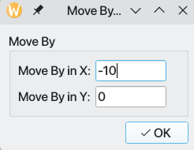

- `Edit -> Move Origin`: reposition the view origin for coordinates. After selecting the menu item, click and release the left-mouse button at the point that will be the new origin of the schematic. Note that it will be snapped to the nearest grid point and thus might differ from the left mouse button release point.
- `Edit -> Rotate`: rotate the selected items around the pivot point. Select an item on the 
  schematic, click `Rotate` menu item and click once again on the item to select the origin 
  of rotation.
- `Edit -> Align Items`: align edges or centers using the align dialog.

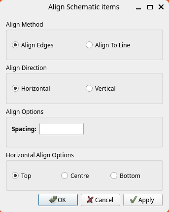

There are two methods of alignment:
 1. Align Edges: Select more than one item and then decide alignment direction (horizontal or vertical) and optional spacing between items. You also need to select how the items should be aligned: top, centre or bottom. Then press `OK` to align the items. If the alignment is wrong, you could undo it by pressing `u` key.
 2. Align To Line: Again select more than one item.  If a horizontal alignment is required draw a horizontal line or draw a vertical line if a vertical alignment is desired. Click left mouse button at the start of the alignment line and pull the mouse cursor to the desired end point and release the left mouse button. A thin red line should be drawn. The length of the alignment guide line is not important.

Similarly to `Align Edges` option, the user can select alignment direction (horizontal or vertical), spacing between the items, and alignment edge (top, centre, bottom for horizontal alignment and left, centre, right for vertical alignment).

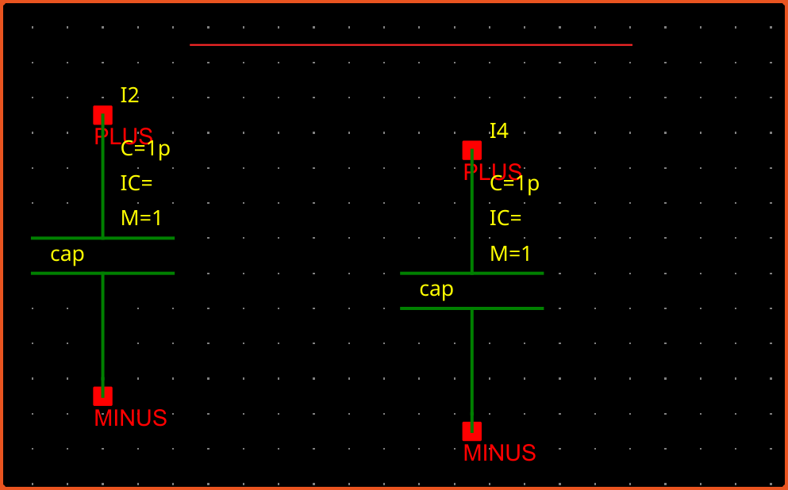

- `Edit -> Horizontal Flip`: Flip selected items horizontally.
- `Edit -> Vertical Flip`: Flip selected items vertically.
- `Edit -> Selection`: This menu has two submenus:
  - `Select All`: Select everything on the schematic.
  - `Unselect All`: Unselect everything on the schematic.
- `Edit -> Net Name`: This menu item opens a small dialogue so that the user can enter the net name. Once the dialogue is closed by pressing `OK` button, a net can be chosen to assign name to. Note that nets can also be named using the properties dialogue.

#### Edit Menu (Hierarchy)

- `Edit -> Hierarchy -> Go Down`: open selected instance in a child view. A dialogue window opens allowing the user to choose one of the available views to descend to. 
  The view types that can be descended into are:
  - Schematic: Opens the schematic editor for the instance.
  - Symbol: Opens the symbol editor for the instance.
  - Verilog-a: Opens the Verilog-a editor for the instance.
  - Spice: Opens the spice editor for the instance.
  Schematic and Symbol editors have additional buttons on their toolbars for moving back up to hierarchy when they are started with hierarchy operation. Verilog-a and Spice editors also offer the import dialogue when the editing is finished and the window is closed.  
- `Edit -> Hierarchy -> Go Up`: return to the parent schematic. 


### Edit menu actions and shortcuts:

| Action | Shortcut | Notes |
| --- | --- | --- |
| `Edit -> Undo` | `U` | Reverts the most recent schematic edit in the undo stack. |
| `Edit -> Redo` | `Shift+U` | Reapplies the last undone operation. |
| `Edit -> Paste` | None | Inserts the last copied selection at the cursor location. |
| `Edit -> Copy` | `C` | Copies the current selection for pasting. |
| `Edit -> Delete` | `Delete` | Removes selected items from the schematic. |
| `Edit -> Move` | None | Starts interactive move mode for the selected items. |
| `Edit -> Move By` | None | Moves the selection by a precise X/Y offset. |
| `Edit -> Move Origin` | None | Repositions the view origin used for coordinates. |
| `Edit -> Rotate` | `Ctrl+R` | Rotates the selected items around the current pivot. |
| `Edit -> Stretch` | `S` | Stretches wires or shapes by dragging a segment. |
| `Edit -> Flip Horizontal` | None | Mirrors the selection across a vertical axis. |
| `Edit -> Flip Vertical` | None | Mirrors the selection across a horizontal axis. |
| `Edit -> Align Items` | `Shift+A` | Aligns selection edges or centers using the align dialog. |
| `Edit -> Selection -> Select All` | `Ctrl+A` | Selects every item in the active schematic view. |
| `Edit -> Selection -> Deselect All` | None | Clears the selection without changing geometry. |
| `Edit -> Properties -> Object Properties` | `Q` | Opens the property dialog for the selected item(s). |
| `Edit -> Net Name` | `L` | Assigns or edits the name of the selected net. |


### Create Menu


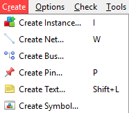


- `Create -> Instance...`: open the symbol selector and place an instance on the schematic. The instance is normally a symbol. Using `Select CellView` dialogue, the user can choose the design library, cell and cellview to instantiate the desired symbol. Instance will follow the mouse cursor and will be placed at where left-mouse button is released and immediately another instance of the same symbol will follow the mouse cursor. If the user wants to stop the instantiation process at that time, `esc` key will return to the selection mode.
- 
  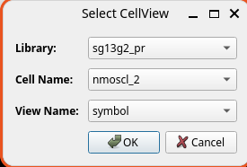

  After placing the instance on the schematic, the user can change the instance properties by selecting the instance and pressing `q` key or selection `Edit -> Properties` submenu.

  Like nets, an array of instances can be created using array notation for the instance name:

  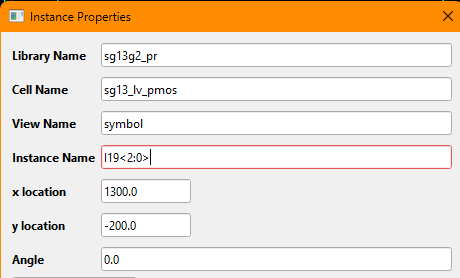

Such an instance array will be expanded when netlisting to create a list of instances between the two instance terminals.

- `Create -> Net`: enter wire mode and draw orthogonal connections normally between instance 
  pins. You can name the nets using `Edit-> Net Name` menu item, pressing `l` key or using 
  net properties dialogue by selecting the net and pressing `q` key.
- `Create -> Bus`: enter a bus, i.e. an ordered bundle of wires. Nets and busses are 
  interchangeable. Busses are drawn wider and have normally more than one wire bundled together.
  A bus is indicated with bus notation: `bus_name<high:low>` or `bus_name<low:high>`. 
  
- `Create -> Pin`: place a schematic pin with direction (Input/Output/InOut). 
Like busses, a schematic can also have a vector notation to connect indicating more than one pin
is bundled.
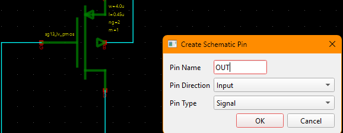

- `Create -> Text`: place a text annotation on schematic to aid the documentation. Select the menu item or press `Shift+L` key combination to open `Edit Text` menu. Write your annotation text in the provided space. Your text can have more than one paragraph and text breaks.

Unlike legacy software, Revolution EDA can use any fonts installed on your computer at all available font sizes.

<table>
  <tr>
    <td>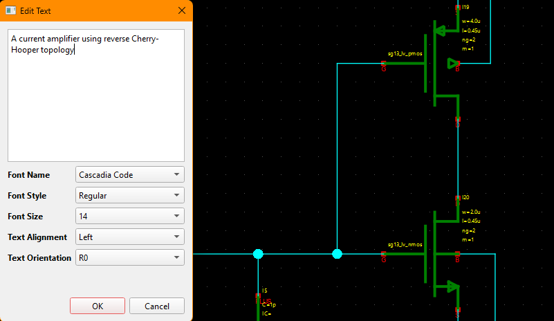</td>
    <td>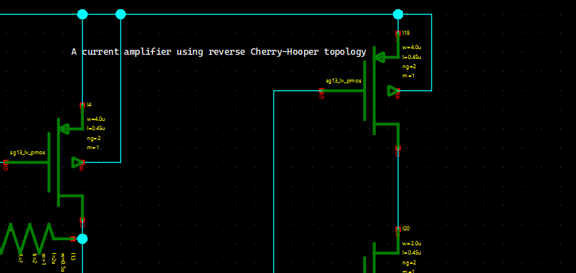</td>
  </tr>
</table>

- `Create -> Create Symbol...`: generate a symbol view from the schematic. The schematic pins will be used to generate symbol pins.

A symbol for the schematic can be created using this menu item. The schematic pins will be used to generate symbol pins. The side of the symbol pins, their spacing on each side and the length of pin stubs can all be specified.
<table>
  <tr>
    <td>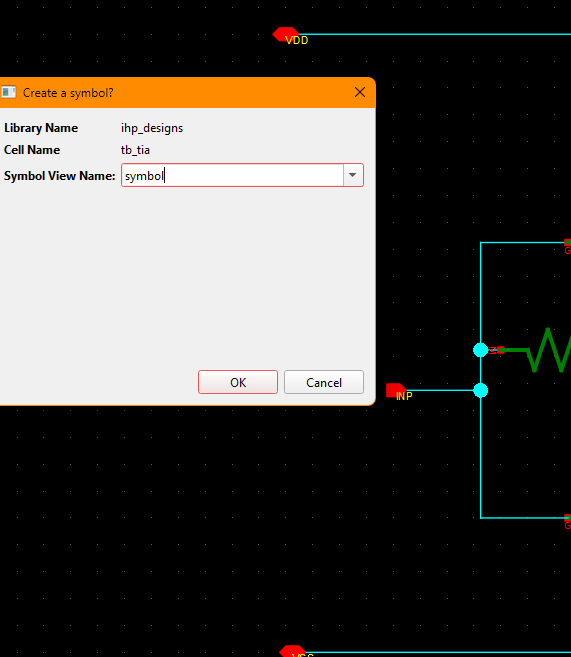</td>
    <td>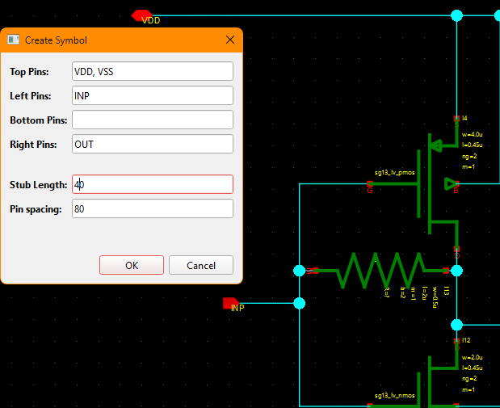</td>
  </tr>
</table>

There are two important points:
1. Symbol view name should include *symbol* in it. Thus `symbol`, `1symbol`, or `symbol_2` are all valid names, but `symbo` is not a *valid* symbol view name.
2. Try to be consistent in stub lengths and pin spacing within a design library.

### Options Menu

The schematic editor inherits the `Options` menu from the base editor window.

- `Options -> Display Config...`: configure display options for the editor view. `Grid Spacing` refers to spacing of of the grid dots at the largest zoom of the schematic. The instance and nets can only be drawn on that grid to ease the alignment of the instances, nets and pins. 

`Snap Distance` is the distance where nets are snapped to symbol or schematic pins.

Both of these settings are saved to schematic file and will be reloaded with the schematic.

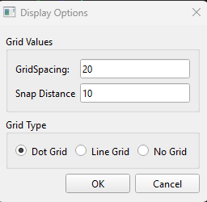

- `Options -> Selection Config...`: configure canvas selection behavior. The selection behaviour configured by this dialogue refers to how elements on the schematic are selected with selection rectangle:
1. When `Full` radio button is selected, only items whose selection box fully covered by the selection rectangle will be added to the selection set.
2. When `Partial` radio button is selected, items whose selection box partially overlaps will also be added to the selection set.

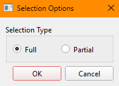


### Tools Menu
- `Tools -> Read Only`: Toggling this menu will lock the schematic to editing. To unlock the schematic, unlock the menu item.

- `Tools -> Highlight Net`: enable when checked is used to toggle hover-based net highlighting. When this menu item is toggled and cursor is hovering over a net, purple flight lines will be drawn to all other nets that is connected to that net by other wires or by name:

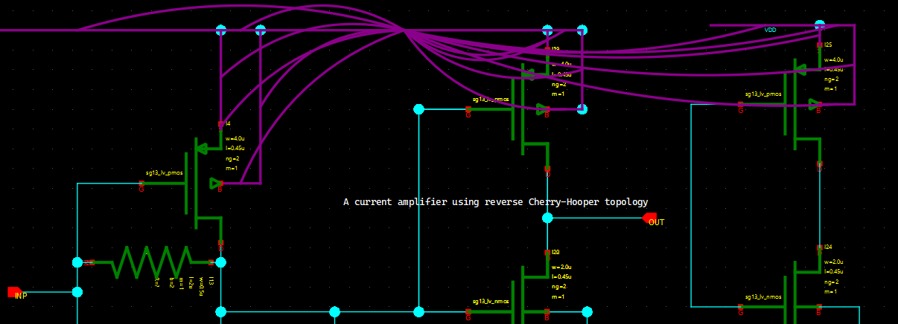

- `Tools -> Renumber Instances`: This menu starts the process of renumbering of all schematic instances. This might be needed when the instance names could be repeated among different instances, making some operations like netlisting problematic.

- `Tools -> Find related editors`: When the user goes down a symbol to open related schematic, there might be more than a few schematic editor open depending on the hierarchy depth. Moreover, there could be schematic editors open that are not related to that design. This menu item opens a dialogue that allows the user to choose and highlight any schematic editor that was opened as a part of hierarchical editing.

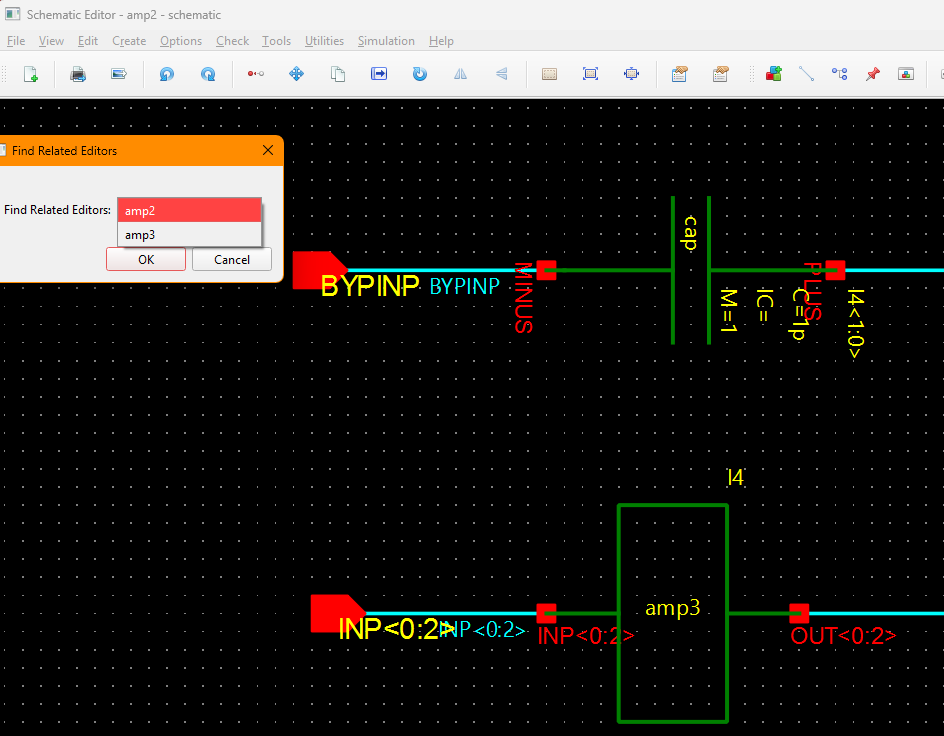

### Simulation Menu

- `Simulation -> Create Netlist...`: export a netlist for the current view.
- `Simulation -> Simulation Environment...`: open simulation UI (requires `revedasim` plugin).

<!-- Screenshot: Simulation menu -->

## Core Workflows

### 1) Place Instances

Use any of the following:

- Press `i`
- `Create -> Instance...`
- Toolbar instance button

The instance dialog lists symbol views. Select one, click `OK`, then click in the canvas.
Auto-generated instance names follow the symbol's naming label (for example `[@instName]`).

<!-- Screenshot: Instance selection dialog -->

Open instance properties with `q`:

- Change instance name, location, and rotation
- Edit label values (including PyLabel-evaluated parameters)
- View read-only symbol attributes

<!-- Screenshot: Instance properties dialog -->

Missing instance views appear as a gray placeholder box with full library path.

<!-- Screenshot: Missing instance placeholder -->

### 2) Wire and Name Nets

Enter wire mode with `w`.

Behavior highlights:

- Orthogonal routing with automatic bends
- Snap-to-pin and snap-to-net
- Collinear merge into a single segment
- Automatic junction dots on T-connections

Use `Net Properties` to name a net. The name propagates across connected segments.

<!-- Screenshot: Net naming dialog -->

Net highlighting:

- Toggle `Tools -> Highlight Net`
- Hover a net to display the full connected set

<!-- Screenshot: Net highlight overlay -->

### 3) Create Pins

Press `p` and place schematic pins for hierarchical connectivity.

Pin directions:

- Input
- Output
- InOut

Pins snap to wires and re-route connected nets when moved.

<!-- Screenshot: Pin placement + snapping example -->

### 4) Text and Annotation

Use text tool to place annotations with monospaced fonts.
Rotate and edit text in the property dialog (`q`).

<!-- Screenshot: Text entry dialog -->
<!-- Screenshot: Text rotation controls -->

### 5) Generate a Symbol from a Schematic

Create a symbol from pin definitions:

1. Place all pins in the schematic.
2. `Create -> Create Symbol...`
3. Enter symbol view name and confirm overwrite if needed.
4. Adjust stub length and spacing if desired.

<!-- Screenshot: Create Symbol dialog -->
<!-- Screenshot: Symbol properties dialog -->

The generated symbol opens in a new window.

<!-- Screenshot: Generated symbol view -->

## Netlisting and Simulation

### Netlisting

Start netlisting with `Simulation -> Create Netlist...`.

Key concepts:

- **Switch view list**: preferred view order (schematic vs veriloga vs symbol)
- **Stop view list**: stop traversal at a given view (for example `symbol`)
- **Config view**: explicit per-cell view selection

<!-- Screenshot: Export Netlist dialog -->

The netlister runs in background threads and produces consistent output file naming:

```
cellName_viewName.cir
```

### Simulation Integration

Simulation is provided by the `revedasim` plugin.

- Revbench-based testbenches
- DC/AC/transient/noise analyses
- Parameter sweeps
- Interactive net/component selection

<!-- Screenshot: Simulation environment window -->

## Hierarchy Traversal

Go down into a cell from a selected instance:

- Toolbar `Go Down`
- `Edit -> Hierarchy -> Go Down`
- `Shift+E`
- Context menu `Go Down`

Select view type (schematic/symbol) and open in edit or read-only mode.

<!-- Screenshot: Go Down dialog -->

Return to parent with `Go Up` and the schematic updates immediately.

<!-- Screenshot: Go Up toolbar button -->
