# Revolution EDA Symbol Editor

This guide targets designers already familiar with symbol editing in custom IC design tools
such as Cadence Virtuoso. The Symbol Editor is where you create the graphical representation
of a device or cell for later use in the schematic editor.

The Revolution EDA Symbol Editor is designed for representing integrated circuit components
with geometry, pins, labels, and netlisting attributes. It provides basic drawing tools for
creating:

1. Lines
2. Circles
3. Arcs
4. Rectangles
5. Polygons

Edits can be undone or redone using toolbar buttons or the `U` / `Shift+U`
keys.

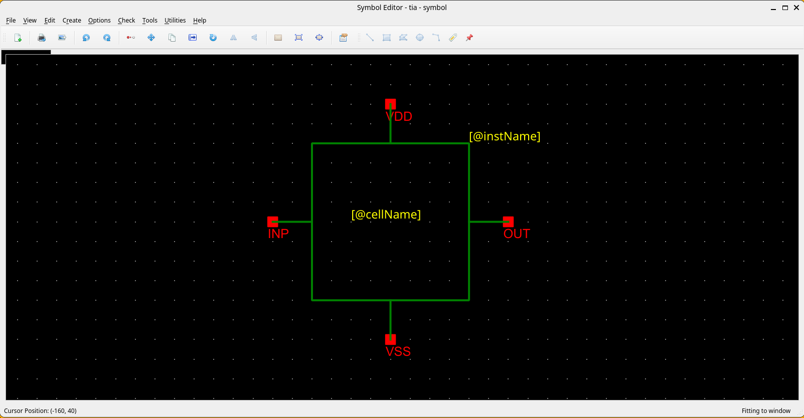

## Quick Orientation (for Virtuoso Users)

| Virtuoso Action | Revolution EDA Equivalent | Notes |
|---|---|---|
| Add wire/line | `Create -> Create Line...` or `W` | Draws horizontal/vertical line segments |
| Add rectangle | `Create -> Create Rectangle...` or `R` | Click two diagonal corners |
| Add circle | `Create -> Create Circle...` | Click centre, drag to set radius |
| Add arc | `Create -> Create Arc...` | Two-corner bounding box; direction set by diagonal angle |
| Add polygon | `Create -> Create Polygon...` | Left-click to add points; double-click to finish |
| Add pin | `Create -> Create Pin...` or `P` | Set name, direction, and type in the dialog |
| Add label | `Create -> Create Label...` or `L` | Normal, NLPLabel, or PyLabel types |
| Edit properties | Select item, press `Q` | Shape, pin, or label properties |
| Edit cellview attributes | `Edit -> Cellview Properties...` | Symbol-level netlist attributes |
| Stretch shape | Select item, press `S` | Adjust endpoints/radius of lines, arcs, circles |
| Undo | `U` | Up to 99-level undo stack |
| Redo | `Shift+U` | Reapply the last undone operation |
| Fit to window | `F` | Scales the view to show all items |

## Typical Symbol Flow

1. Open or create a symbol view from the Library Browser.
2. Draw the basic outline using lines, rectangles, circles, arcs, or polygons.
3. Add symbol pins.
4. Add labels for instance-visible parameters or metadata.
5. Open `Edit -> Cellview Properties...` to review labels and symbol attributes.
6. Use the symbol in the schematic editor.

<!-- Screenshot placeholder: Typical symbol editing flow -->

## Symbol Shortcuts at a Glance

| Key | Action |
|---|---|
| `W` | Create Line |
| `R` | Create Rectangle |
| `P` | Create Pin |
| `L` | Create Label |
| `S` | Stretch selected item |
| `C` | Copy selected items |
| `U` | Undo |
| `Shift+U` | Redo |
| `Q` | Object Properties |
| `F` | Fit to Window |
| `Delete` | Delete selected items |
| `Ctrl+R` | Rotate 90° CW |
| `Ctrl+A` | Select All |
| `Shift+A` | Align Items |

## Menu Actions You Will Use Most

### File Menu

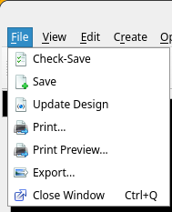

The File menu handles saving, printing, and exporting the symbol cellview.

| Action | Shortcut | Notes |
|---|---|---|
| `File -> Check-Save` | None | Validates and saves the symbol to disk. |
| `File -> Save` | None | Saves without running checks. |
| `File -> Update Design` | None | Reloads all referenced cell data from disk. |
| `File -> Print...` | None | Sends the symbol view to a printer. |
| `File -> Print Preview...` | None | Preview print output before printing. |
| `File -> Export...` | None | Exports the symbol as a PNG/JPEG/BMP image file. |
| `File -> Close Window` | `Ctrl+Q` | Closes the window; symbol is auto-saved on close. |

### View Menu

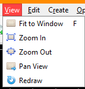

| Action | Shortcut | Notes |
|---|---|---|
| `View -> Fit to Window` | `F` | Scales the view to show all symbol items. |
| `View -> Zoom In` | None | Increases magnification; mouse wheel also zooms. |
| `View -> Zoom Out` | None | Decreases magnification. |
| `View -> Pan View` | None | Click to re-centre the view at the clicked point. |
| `View -> Redraw` | None | Forces a full repaint of the scene. |

### Edit Menu

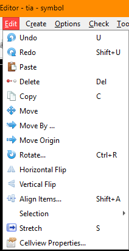

The Edit menu provides shape manipulation, transformation, and undo/redo commands.

| Action | Shortcut | Notes |
|---|---|---|
| `Edit -> Undo` | `U` | Reverts the most recent change (up to 99 levels). |
| `Edit -> Redo` | `Shift+U` | Reapplies the last undone change. |
| `Edit -> Paste` | None | Pastes copied items at the cursor location. |
| `Edit -> Delete` | `Delete` | Removes selected items from the symbol. |
| `Edit -> Copy` | `C` | Copies the current selection for pasting. |
| `Edit -> Move` | None | Moves selected items interactively on the canvas. |
| `Edit -> Move By...` | None | Moves the selection by a precise X/Y offset via dialog. |
| `Edit -> Move Origin` | None | Repositions the scene origin; click to set the new point. |
| `Edit -> Stretch` | `S` | Adjusts endpoints of lines, arcs, and radius of circles. |
| `Edit -> Rotate...` | `Ctrl+R` | Rotates selected items 90° clockwise around a pivot point. |
| `Edit -> Horizontal Flip` | None | Mirrors selected items across the vertical axis. |
| `Edit -> Vertical Flip` | None | Mirrors selected items across the horizontal axis. |
| `Edit -> Align Items...` | `Shift+A` | Opens the alignment dialog for edge or guide-line alignment. |
| `Edit -> Selection -> Select All` | `Ctrl+A` | Selects every item in the symbol view. |
| `Edit -> Selection -> Unselect All` | None | Clears the current selection. |
| `Edit -> Cellview Properties...` | None | Opens the symbol attributes and label summary dialog. |

### Create Menu

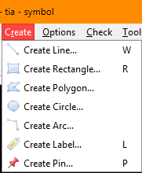

| Action | Shortcut | Notes |
|---|---|---|
| `Create -> Create Line...` | `W` | Draw a line segment: click to start, release to end. |
| `Create -> Create Rectangle...` | `R` | Click two diagonal corners to define the rectangle. |
| `Create -> Create Polygon...` | None | Left-click to add points; double-click to finish. |
| `Create -> Create Circle...` | None | Click the centre point, then drag to set the radius. |
| `Create -> Create Arc...` | None | Click two diagonal corners; arc direction follows the diagonal angle. |
| `Create -> Create Label...` | `L` | Opens the label dialog; choose Normal, NLPLabel, or PyLabel type. |
| `Create -> Create Pin...` | `P` | Opens the pin dialog to set pin name, type, and direction. |

### Options Menu

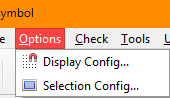

The symbol editor inherits the `Options` menu from the base editor window.

- `Options -> Display Config...`: configure the grid display (dot or line grid) and the major/snap grid spacing.
- `Options -> Selection Config...`: choose between **partial** (intersects items) and **full** (contains items entirely) selection mode.

<table>
    <tr>
        <td></td>
        <td></td>
    </tr>
</table> 

| Action | Notes |
|---|---|
| `Options -> Display Config...` | Major grid, snap grid, dot vs. line grid background. |
| `Options -> Selection Config...` | Partial selection allows rubber-band to intersect shapes; full selection requires full containment. |

### Tools Menu

The symbol editor currently adds a simple tools section focused on edit safety.

| Action | Notes |
|---|---|
| `Tools -> Read Only` | Toggle; when checked, no edits are permitted in the current view. |

## Drawing Actions

### Lines

Lines are drawn by pressing the left mouse button at the start point and releasing it at the
end point. Lines can be horizontal or vertical. A drawn line can be edited by selecting it
and pressing `q`.


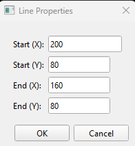

Alternatively, enter Stretch mode by pressing `s` or selecting **Stretch** from the
right-click context menu. The line will turn red, and its endpoints will be indicated by
circles. Click the endpoint to move, drag it to the new location, and release the mouse
button.

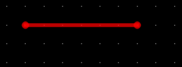


### Circles

Circles are drawn by pressing the left mouse button at the desired centre point and dragging
to set the radius, then releasing. A circle can also be edited by opening the Properties
dialog (select the circle and press `q`, or select **Properties** from the right-click
context menu),

<table>
    <tr>
        <td>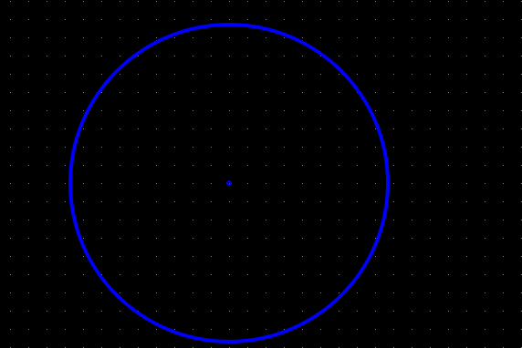</td>
        <td>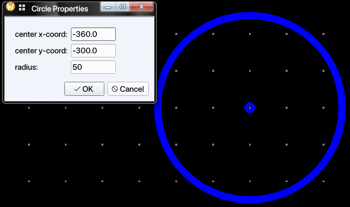</td>
    </tr>
</table> 

Circles can be resized by selecting a circle and pressing `s`, or by selecting **Stretch**
from the right-click context menu. The circle will turn red, and a hand cursor will indicate
that stretching is active. Drag the cursor to resize the circle to the desired radius.

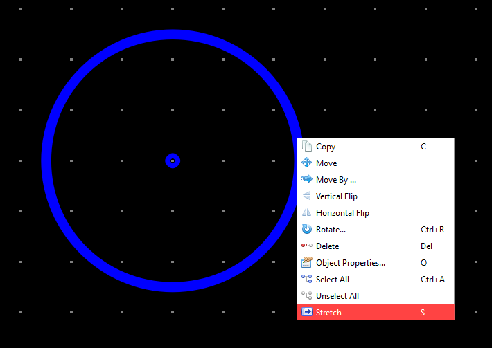

### Rectangles

Rectangles are created by pressing the left mouse button at one corner and then
releasing it at the opposite diagonal corner.

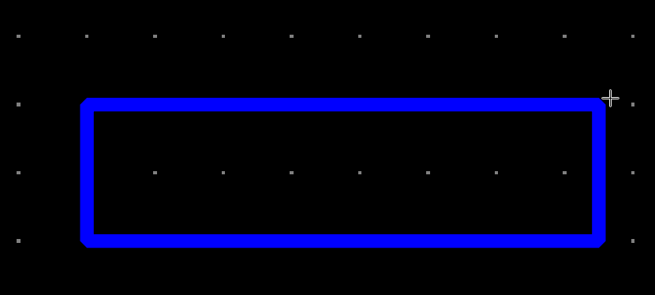

Rectangles can be similarly edited using the properties dialog, or by stretching any side:
select the side and press `s`, or choose **Stretch** from the right-click context menu.

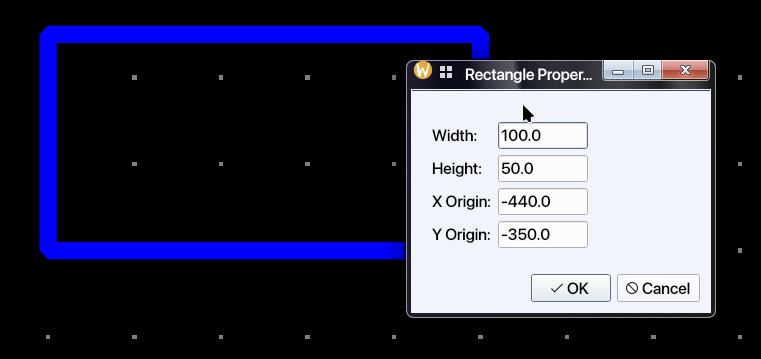

### Arcs

Arc drawing is performed similarly to rectangle drawing. Depending on the diagonal angle 
for the rectangle drawn,  the arc will point in one of the four directions:

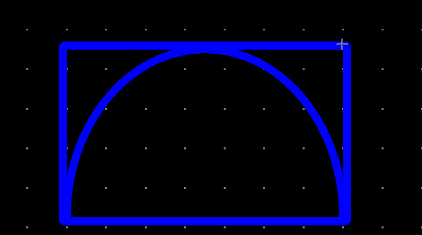

| Diagonal Angle       | Arc Direction |
|----------------------|---------------|
| 90 > $\theta$ > 0    | Up            |
| 180 > $\theta$ > 90  | Left          |
| 270 > $\theta$ > 180 | Down          |
| 360 > $\theta$ > 270 | Right         |

Arcs can also be edited using the property dialog or by stretching. To stretch an arc,
select the arc and press `s`, or select **Stretch** from the right-click context menu. The arc will
turn red Click on the desired side to be stretched and move that side while holding the mouse button 
pressed to stretch the arc. Release the mouse button when arc is stretched to the 
desired shape.

<table>
    <tr>
        <td>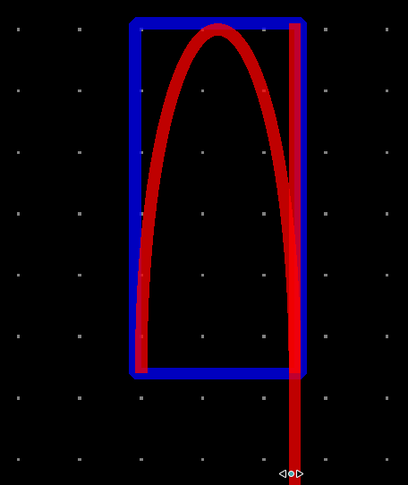</td>
        <td>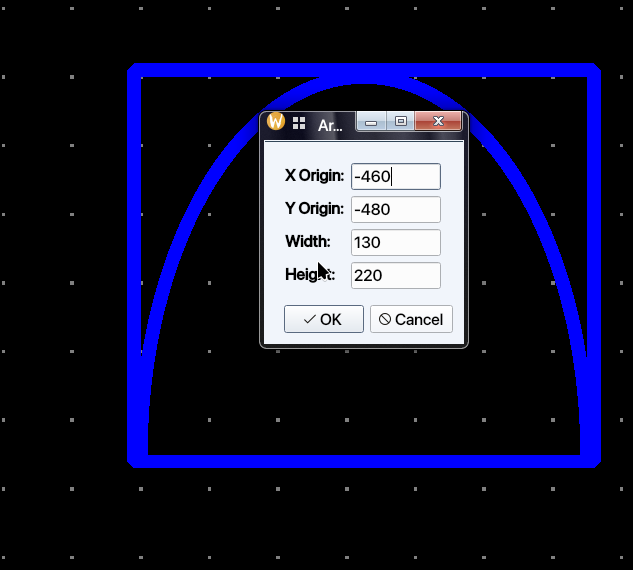</td>
    </tr>
</table> 


### Polygons

Polygons are created by selecting **Create → Create Polygon…** from the menu or clicking
the **Create Polygon** toolbar button. To place the first point, left-click on the canvas.
A guide line will be shown between that point and the current cursor location. Left-click
again to place the second point; a line will be drawn between the first and second points,
and the guide line will advance to follow the cursor from the second point. Each
subsequent left-click adds a new vertex and extends the polygon. Once three or more points
have been placed, the enclosed area is highlighted. Double-click to finish the polygon, or
press `Esc` to cancel. Each additional point yields a polygon with one more side
(quadrilateral, pentagon, and so on).

<table>
    <tr>
        <td>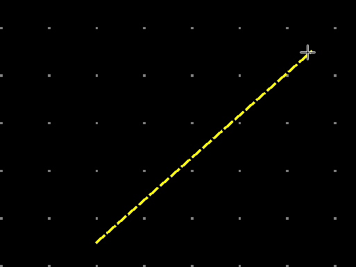</td>
        <td>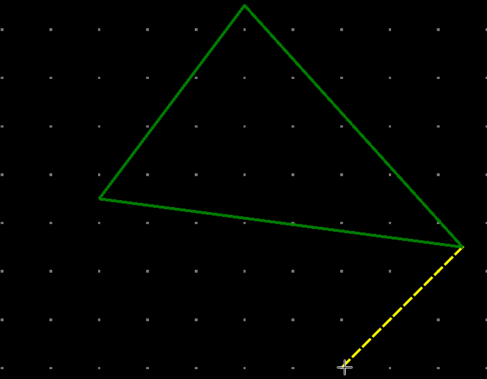</td>
    </tr>
</table> 

A polygon can be edited in several ways. The simplest is to select the polygon and press
`S` to enter Stretch mode. Click one of the corners to select it; a red circle will
appear at that corner. Drag the cursor to the desired position and release the mouse button
to set the new corner location.

Polygons can be also be edited using a dialogue. Select the polygon and bring up the
`Symbol Polygon Properties` dialogue. All the points will be listed with their x and y
coordinates. The designer can delete any point selecting the checkbox on the first column or
edit that point. Alternatively, a new point can be edited using the last empty row. When
that row is edited, a new row is created for further point entry. There can be up to 999
points in a polygon.

<table>
    <tr>
        <td>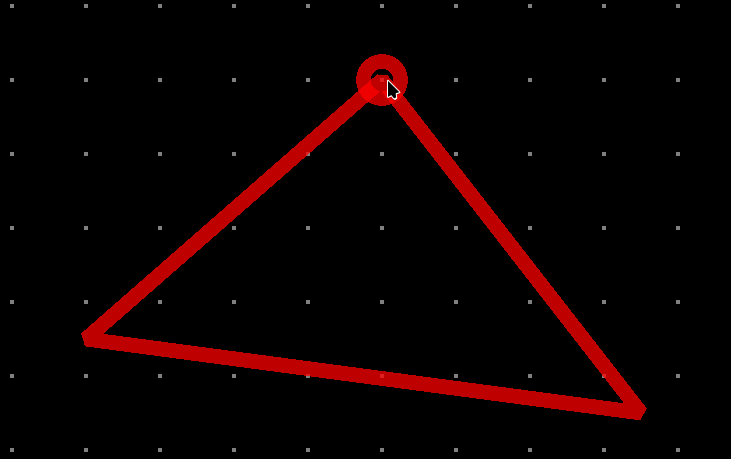</td>
        <td>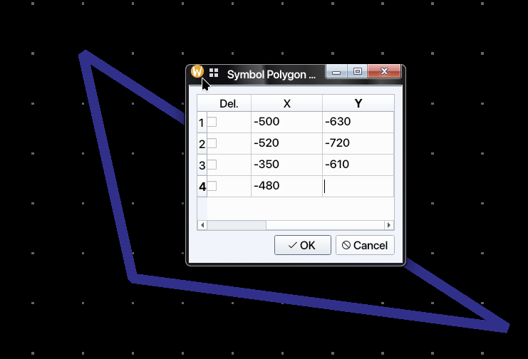</td>
    </tr>
</table> 

### Pins

Pins denote the connections of the element or circuit defined by the symbol to external
circuits. Pins can be created by clicking the toolbar icon or by selecting
**Create → Create Pin…** from the menu. Once the dialogue is closed, the newly created 
symbol pin can be placed on the symbol.

<table>
    <tr>
        <td>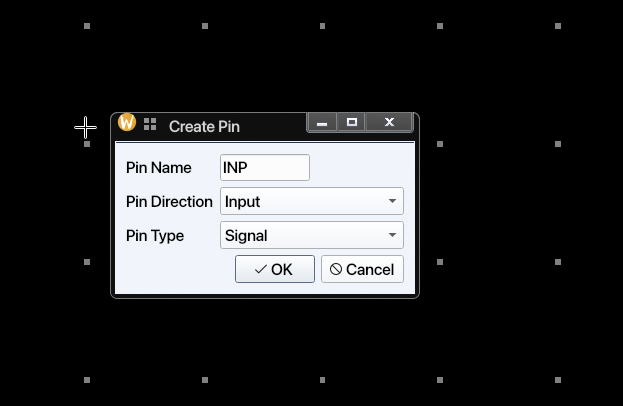</td>
        <td>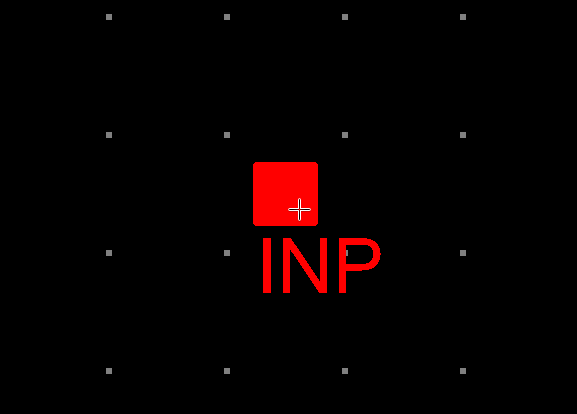</td>
    </tr>
</table> 

> **Note:** Pin direction and pin type information is currently not used or saved for symbol
> cell views.


## Labels and Symbol Metadata

Labels carry all the relevant information for an instance of a cellview. Thus labels may
have different values (texts) for each instance.

There are three types of labels:

1. **Normal**: These labels add static text annotations to the schematic. They are not used
   in netlisting.

2. **NLPLabel**: These types of labels are evaluated using simple rules. Their format is:

   `[@propertyName:propertyName=%:propertyName=defaultValue]`

   The parts of the NLPLabel is separated by columns(:). Note that
   only **@propertyName** part is mandatory. The second and third parts
   do not need to exist in all NLPLabels.

   If only first part exists, there are a limited number of *predefined* labels that can be
   used.
   These are:

   | Label Name     | Label Definition | Explanation                                       |
   | -------------- | ---------------- | ------------------------------------------------- |
   | cell name      | `[@cellName]`    | Cell Name, e.g. nand2, nmos, etc                  |
   | instance name  | `[@instName]`    | Instance name for netlisting, e.g. I1, I15, etc.  |
   | library Name   | `[@libName]`     | Library Name for the symbol                       |
   | view Name      | `[@viewName]`    | View Name, normally includes *symbol* in the name |
   | element Number | `[@elementNum]`  | Element Number, forms a part of Instance Name     |
   | model Name     | `[@modelName]`   | Model name for the element in the netlist         |

   Model name label `[@modelName]` defaults to `modelName` entry in symbol attributes. If
   the third part exists, the label text is determined by whether a label value is entered
   for the instance. If the label value is entered, then the second part is used to display
   the label, if not the third part is shown and used.

   NLP labels are referenced by the first part of their label definition. For example,
   if the label definition
   is `[@w:w=%:w=1u]`, then the label can be referenced in the symbol attributes as `@w`.

   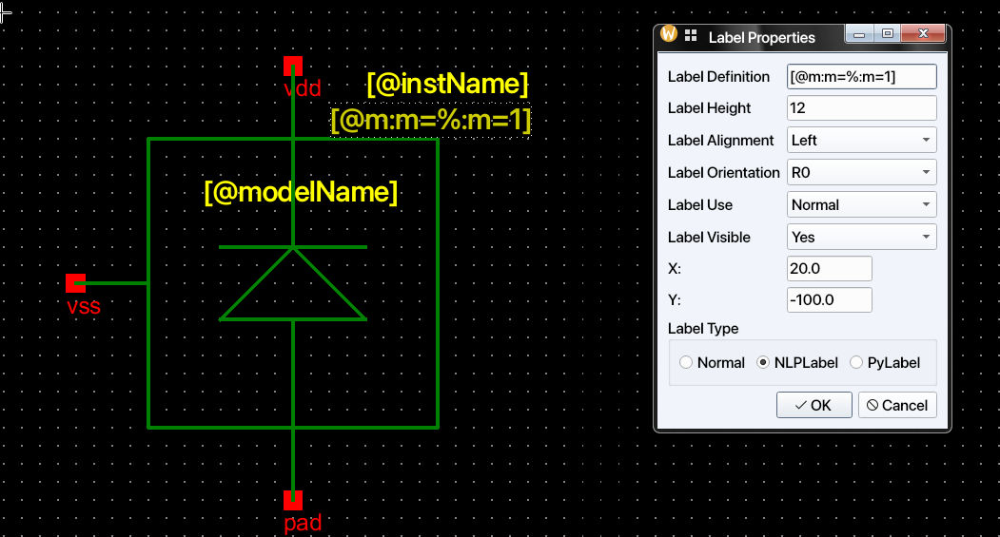
   
3. **Python Label**: Python labels allow the label values to be determined dynamically based
   on the
   values of other labels or any other values defined in the process design kit (PDK). The
   relevant functions that can be used in Python labels are defined in the
   `PDK/callbacks.py`
   file. Each symbol should have a corresponding class defined in `callbacks.py`. The 
   code below is extracted from IHP SG13G2 PDK. Quantity is a method from `quantiphy` 
   package to recognize the scientific numbers and units.

   ```python
   from quantiphy import Quantity

   class baseInst:
       def __init__(self, labels_dict: dict):
           self._labelsDict = labels_dict
   
       def __repr__(self):
           return f"{self.__class__.__name__}({self._labelsDict})"

   class rsil(baseInst):
       def __init__(self, labels_dict: dict):
           super().__init__(labels_dict)
           self.w = Quantity(self._labelsDict["@w"].labelValue)
           self.l = Quantity(self._labelsDict["@l"].labelValue)
           self.b = Quantity(self._labelsDict["@b"].labelValue)
           self.m = Quantity(self._labelsDict["@m"].labelValue)

       def R_parm(self):
           return (
               9.0e-6 / self.w
               + 7.0
               * ((self.b + 1) * self.l + (1.081 * (self.w + 1.0e-8) + 0.18e-6) * self.b)
               / (self.w + 1.0e-8)
           ) / self.m
   ```

For example, an `rsil` symbol has an `R_parm()` method defined. We can use it to define
the value of a label for the `rsil` symbol. When this symbol is instantiated in a schematic, the value of the
`R` label will be determined  by the `R_parm()` function defined in the `callbacks.py` 
file of IHP PDK. This means that instance callbacks can use all the facilities of Python,
including advanced libraries, to calculate parameters dynamically. Note that `R` value 
can depend on the evaluate value of other `NLPLabel`s.

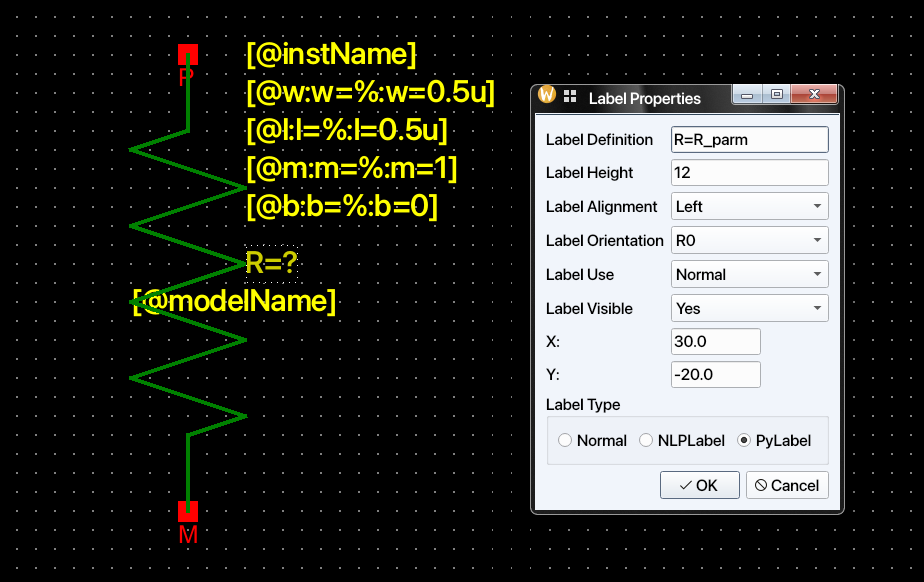

Labels can also be hidden to reduce clutter in the schematic view of a symbol.
Hidden labels are as valid as visible labels. The Label Properties dialog also
has `labelAlignment`, `labelOrientation`, and `labelUse` fields, which are currently not
implemented. However, labels can be rotated using the **Rotate** option in the context
menu.

## Symbol Attributes

Attributes are properties that are common to all instances of a symbol. They could denote
for example, how a particular
symbol would be netlisted in Xyce circuit simulator netlist using `SpiceNetlistLine`
attribute. *NLPDeviceFormat*
expressions was originally created for Glade by Peardrop Design Systems. It consists of
string constants and NLP
Expressions.

Some of the important attributes for a symbol are summarized below:

| Attribute Name          | Attribute Use                                           | Example                                                              |
|-------------------------|---------------------------------------------------------|----------------------------------------------------------------------|
| SpiceNetlistLine        | Netlist template used for symbol/spice/veriloga views   | `M@instName %pinOrder %modelName w=@w l=@l nf=@nf as=@as m=@m`      |
| SpiceNetlistLine        | Veriloga-style template example                         | `Yres @instName %pinOrder resModel @R`                               |
| SpiceNetlistLine        | Spice subckt template example                           | `X@instName %pinOrder newckt`                                        |
| vaModelLine             | Used as a model line for Veriloga netlisting            | `.MODEL resModel res R = 1`                                          |
| vaHDLLine               | Used to by Revolution EDA to create linkable modules    | *`.HDL /home/user/exampleLibraries/analogLib/resVa/res.va`           |
| pinOrder                | To sync pin order between netlists of various cellviews | `PLUS, MINUS`                                                        |
| incLine                 | To include imported Spice subcircuit                    | `.INC /home/user/exampleLibraries/anotherLibrary/example1/newckt.sp` |

Note that labels are referenced in symbol attributes by their names prefixed with `@`.
If a symbol attribute is referenced within another symbol attribute, it must be prefixed
with `%`; see the example
for `SpiceNetlistLine` in the table above, where the `modelName` attribute is referenced
as `%modelName`. The `pinOrder`
attribute is important for synchronising the various netlisting formats. It should list all
symbol pins separated by commas in the order required for netlisting. This string replaces
the `%pinOrder` token in the attributes.

Attributes are defined in the **Cellview Properties** dialog, accessible from the
**Edit** menu:

<!-- Screenshot: Cellview properties dialog -->

This dialog has two parts. The first part lists the labels already defined for the symbol;
label properties can be modified, added, or deleted here. The second part is the
**Symbol Attributes** section, where any number of symbol attributes can be defined. These
attributes are not displayed on the canvas, but they can be inspected (though not edited)
in the schematic view.

Depending on how a symbol is created, not all attributes required for netlisting with the
available cell views may be present on that symbol. For example, if a symbol is created
from a schematic but a Verilog-A cell view also exists, the symbol will contain the
`SpiceNetlistLine` attribute for netlisting the symbol view, but it will not include the
attributes needed to netlist the Verilog-A cell view. In that case, those attributes must
be added manually in the Symbol Editor.

### Required attributes for netlisting

The current netlister implementation in `schematicEditor.xyceNetlist` uses
`SpiceNetlistLine` as the netlist template key for symbol, spice, and veriloga views.
In templates, use `%pinOrder` to emit the expanded connection list.

#### Symbol

If a *symbol* cellview is to be used in the netlisting, these are the minimum attributes
that should be defined for that
symbol.

| Attribute Name   | Example                                                        |
|------------------|----------------------------------------------------------------|
| SpiceNetlistLine | `M@instName %pinOrder %modelName w=@w l=@l nf=@nf as=@as m=@m` |
| pinOrder         | `D, G, B, S`                                                   |

Note that another attribute `modelName` needs to be defined for the example in the table.
`pinOrder` controls the net order used by `%pinOrder` during netlisting.

#### Veriloga

If the veriloga cell view is to be used in the circuit netlisting, these attributes should
be added to the symbol. If the Verilog-A file was imported and used to create the symbol,
they will be added automatically.

| Attribute Name          | Example                                                    |
|-------------------------|------------------------------------------------------------|
| SpiceNetlistLine        | `Yres @instName %pinOrder resModel @R`                     |
| vaModelLine             | `.MODEL resModel res R = 1`                                |
| vaHDLLine               | *`.HDL /home/user/exampleLibraries/analogLib/resVa/res.va` |
| pinOrder                | a, b, c                                                    |

`vaModelLine` and `vaHDLLine` are collected and written to the netlist output.

#### Spice

Spice subcircuits can be used in the netlists when the symbol has the proper attributes. The
required attributes for the
netlist inclusion of a SPICE subcircuit are summarised in the table below:

| Attribute Name       | Example                                                              |
|----------------------|----------------------------------------------------------------------|
| SpiceNetlistLine     | `X@instName %pinOrder newckt`                                        |
| incLine              | `.INC /home/user/exampleLibraries/anotherLibrary/example1/newckt.sp` |
| pinOrder             | PLUS, MINUS                                                          |

`incLine` is collected and emitted as an include directive in the generated netlist.

## Other Editing Functions

Any item in the Symbol Editor can be rotated, moved, or copied by selecting the
corresponding menu item, clicking the relevant toolbar button, or using the right-click
context menu.

The cursor position is displayed at the bottom-left corner of the editor. To reposition
the symbol editor's origin point, select **Edit → Move Origin** and click at the desired
new origin location. All subsequent editing operations will use the new origin as the
reference point.

## Context Menu (Right-click on Item)

Right-clicking on a selected item opens a context menu with the most frequently needed
operations without navigating the menu bar.

<!-- Screenshot: Symbol editor context menu -->

| Action | Shortcut | Notes |
|---|---|---|
| Copy | `C` | Copies the selected item; paste with `Edit -> Paste`. |
| Move | None | Starts interactive move mode for the selected item. |
| Move By... | None | Opens a dialog for a precise X/Y offset move. |
| Vertical Flip | None | Mirrors the item across the horizontal axis. |
| Horizontal Flip | None | Mirrors the item across the vertical axis. |
| Rotate | `Ctrl+R` | Rotates the item 90° clockwise. |
| Delete | `Delete` | Removes the item from the symbol. |
| Object Properties... | `Q` | Opens the property dialog for the item (shape, pin, or label). |
| Select All | `Ctrl+A` | Selects every item in the symbol view. |
| Unselect All | None | Clears the current selection. |
| Stretch | `S` | Enters stretch mode for the selected item. |

## Final Notes

- Use the Symbol Editor for both graphics and netlisting metadata; a good symbol needs both.
- `Q` and `Edit -> Cellview Properties...` are the two most important follow-up tools after
  drawing the symbol outline.
- Keep pin naming and `pinOrder` consistent with the cellviews you intend to netlist.
- If a symbol is created automatically from another flow, review its labels and attributes
  before using it widely in schematics.

